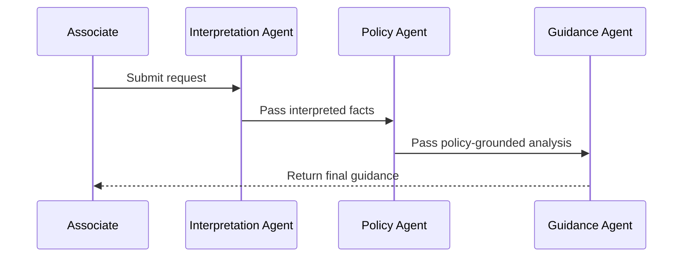
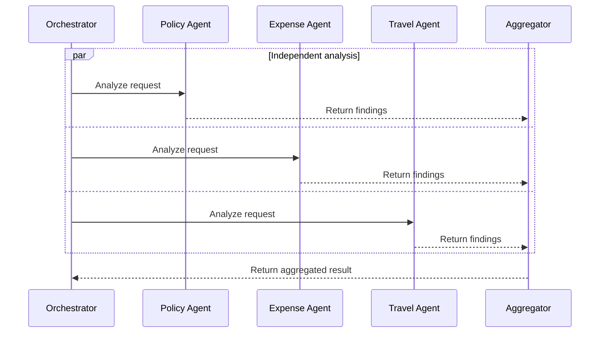
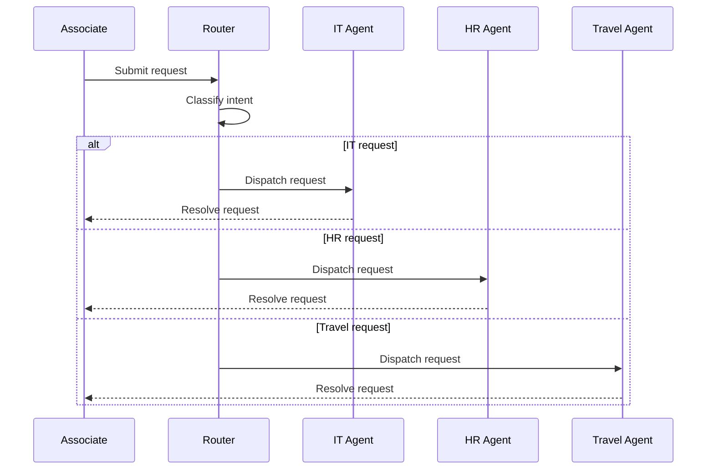
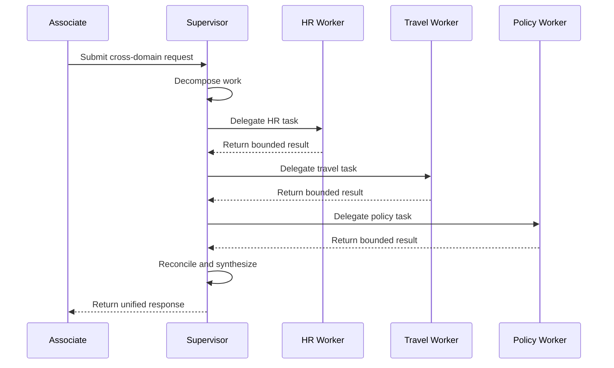
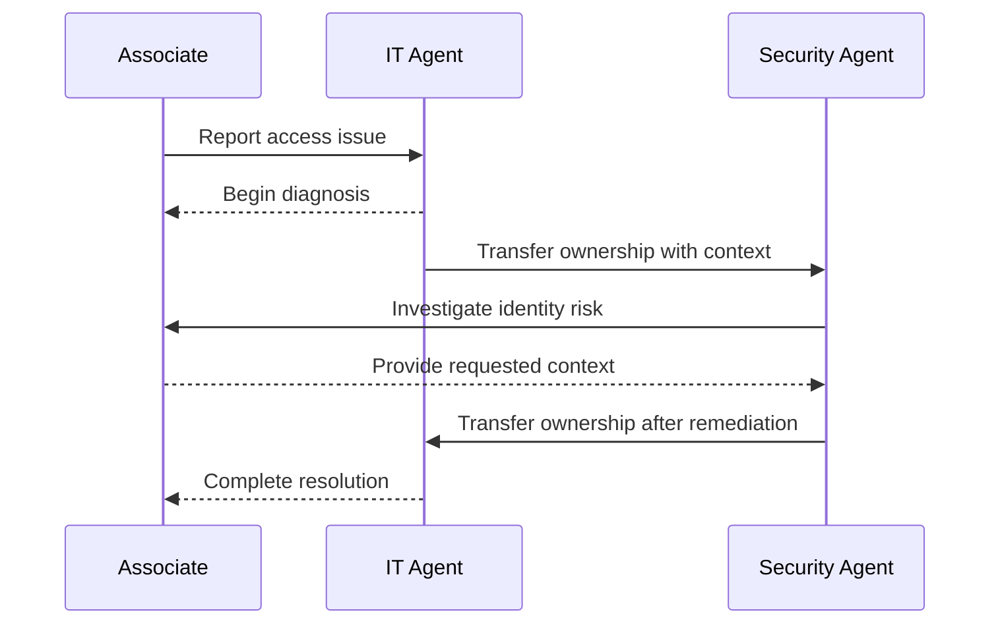
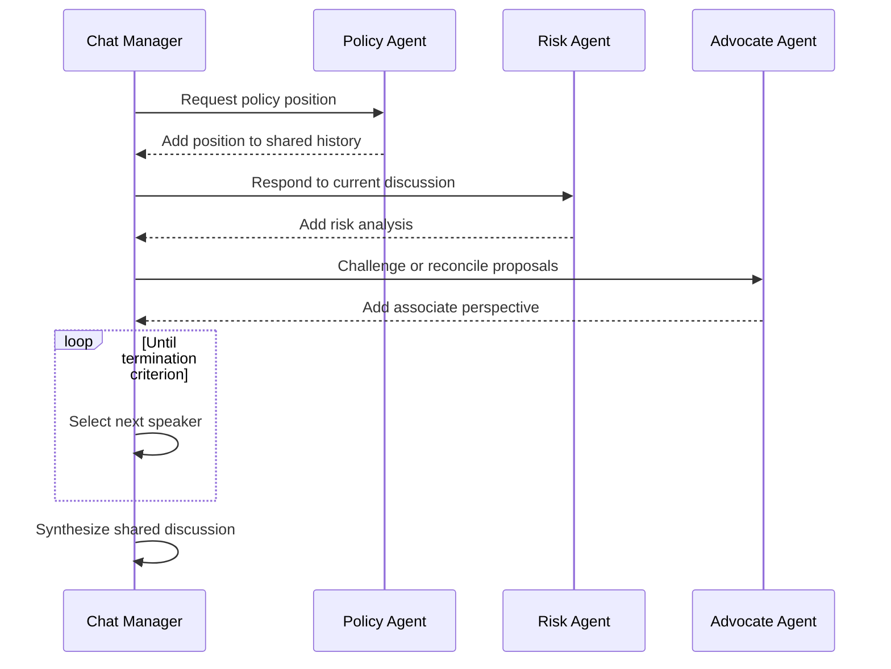
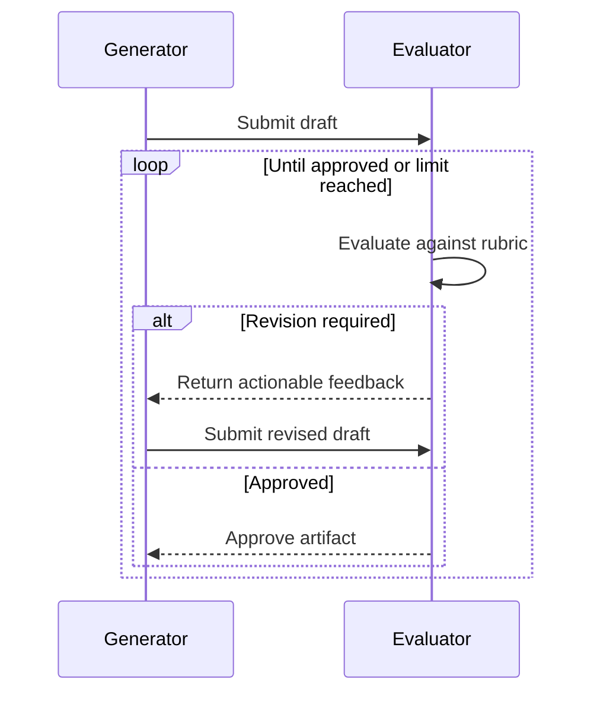
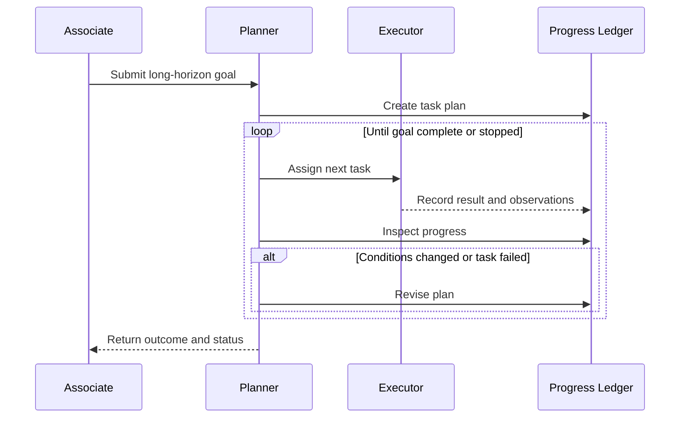
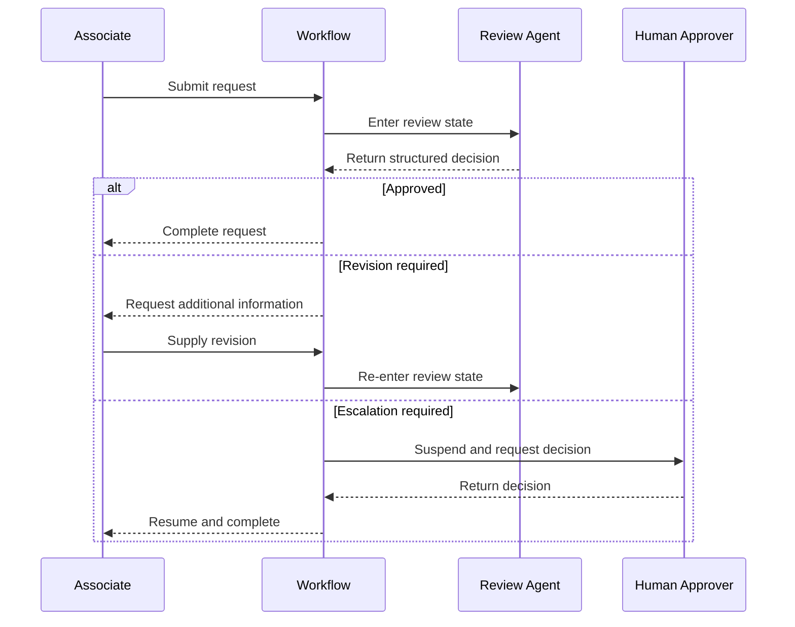
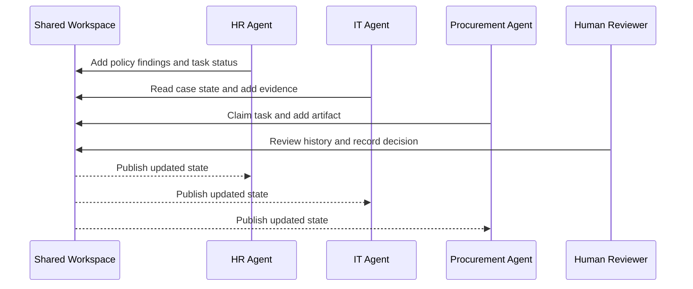

# Selecting Agentic Architecture Patterns on the Microsoft Stack

> **First draft — content architecture**
>
> Audience: solution architects  
> Scenario lens: associate-facing workplace services in a professional-services firm  
> Product maturity: preview capabilities are included only when labeled

## Executive position

Agentic architecture should begin with the simplest control model that can satisfy the use case. Multi-agent orchestration is justified when work requires multiple specialized roles, independent context or permissions, explicit delegation, parallel analysis, collaborative reasoning, adaptive planning, or durable coordination.

When multi-agent orchestration is justified, select the **primary pattern** according to the dominant behavior of the solution. Then add supporting quality protocols, control-flow constructs, and operational services as needed.

This asset uses a vendor-neutral taxonomy and a flat catalog of ten primary patterns. It positions **Microsoft Agent Framework** as Microsoft's most complete code-first foundation for implementing the catalog. Copilot Studio and Microsoft Foundry provide complementary low-code and managed pro-code implementation profiles.

After selecting a pattern, use the companion [Agentic Pattern Implementation Requirements and Reference Architectures](agentic-patterns-implementation-guide.md) to identify required state, coordination, durability, platform-adjacent services, and application-owned gaps.

The core architecture decision is:

> **What is the simplest pattern that gives the system the required work decomposition, control ownership, and operational behavior?**

## 1. Begin with the architecture gate

Do not begin by selecting a multi-agent pattern. First decide whether agents are needed at all.

| Choose | When it fits | Typical Microsoft implementation |
|---|---|---|
| **Deterministic workflow** | Steps and rules are known; outputs must be predictable; model reasoning adds little value | Agent flows, Power Automate, Logic Apps, Functions, Durable Functions |
| **Single agent with tools** | One reasoning role can own the task; tools and knowledge provide sufficient specialization | Copilot Studio agent, Foundry prompt agent, Agent Framework agent |
| **Multi-agent orchestration** | The work requires distinct roles, isolated context or permissions, parallel work, ownership transfer, collaborative reasoning, adaptive planning, or durable shared coordination | Copilot Studio multi-agent composition for supported cases; Foundry Hosted agents; Agent Framework workflows |

### Use a deterministic workflow when

- Business rules can be expressed explicitly.
- The path must be explainable and repeatable.
- The workflow primarily moves, validates, or transforms data.
- Generative reasoning would create unnecessary cost or variance.

### Use a single agent when

- One agent can retain ownership from request to response.
- Specialization can be supplied through tools, instructions, retrieval, or structured prompts.
- Context and permissions do not need to be isolated by domain.
- Additional agents would mostly duplicate prompts and model calls.

### Use multiple agents when

- Specialists need distinct instructions, tools, data boundaries, identities, or context.
- Independent work can run concurrently.
- One role must evaluate or challenge another.
- Ownership must move between conversational specialists.
- The system must plan, track, and replan long-horizon work.
- Durable tasks or artifacts coordinate asynchronous contributors.

## 2. Use the taxonomy to understand what is being selected

A flat list is useful for selection, but the patterns do not all describe the same architectural dimension.

| Layer | Architectural question | Patterns and capabilities |
|---|---|---|
| **Coordination topology** | How do participants exchange work and control? | Sequential, Parallel, Router, Supervisor, Handoff, Group Chat, Blackboard |
| **Reasoning and quality protocol** | How does the system plan, challenge, or improve its work? | Evaluator–Optimizer, Debate, Ensemble/Voting, Plan-and-Execute, Adaptive Replanning, Magentic |
| **Control-flow composition** | How are branches, loops, state, interruptions, and recovery expressed? | Conditional Graph, State Machine, Human-in-the-Loop, Event-Driven, Durable Workflow |

These dimensions can be composed. A contract review solution, for example, can use a supervisor as its primary pattern, fan out analysis in parallel, run an evaluator loop, require human approval, and checkpoint the process in a durable graph.

For selection purposes, name the pattern that best explains the solution's **dominant behavior**.

## 3. Select the primary pattern

Do not use a first-match checklist. Evaluate workload shape first, then control ownership, and finally operational fit.

### Stage 2: Identify the workload shape

| If the defining behavior is... | Candidate primary pattern |
|---|---|
| Fixed, dependent reasoning or transformation stages | **Sequential Pipeline** |
| A fixed set of independent branches followed by explicit aggregation | **Parallel Fan-Out/Fan-In** |
| Repeated production, evaluation, and revision against criteria | **Evaluator–Optimizer** |
| Long-horizon decomposition, progress tracking, and changing plans | **Plan-and-Execute / Adaptive Replanning** |
| Explicit lifecycle states and permitted transitions—not merely a loop | **Conditional Graph / State Machine** |
| Asynchronous coordination through durable shared artifacts or task state | **Blackboard / Shared Workspace** |

### Stage 3: Determine control ownership

| If the defining control model is... | Candidate primary pattern |
|---|---|
| Select one specialist or workflow, usually at entry | **Router / Dispatcher** |
| A central manager dynamically delegates bounded work and retains the conversation | **Supervisor / Manager–Worker** |
| The active specialist transfers ownership to another specialist | **Handoff / Decentralized** |
| Multiple agents deliberate in a shared conversation | **Group Chat / Shared Conversation** |

### Resolve overlaps

Many solutions match more than one row. Choose the behavior whose removal would most fundamentally change the architecture:

- If a manager dynamically chooses workers and synthesizes their work, choose **Supervisor**; record sequential or parallel execution as supporting behavior.
- If the workers and split are fixed in advance and aggregation is the defining mechanism, choose **Parallel Fan-Out/Fan-In**.
- If an explicit quality loop, adaptive plan, lifecycle model, or durable shared workspace is the reason for the architecture, that protocol or composition model can be the primary pattern.
- Treat the remaining matches as supporting patterns and capabilities.

### Stage 4: Confirm operational fit

Use predictability, latency, cost, durability, observability, human intervention, and failure recovery to confirm or disqualify the candidate. See [Operational fit checks](#8-operational-fit-checks).

## 4. Compare the core ten

| Primary pattern | Dominant control model | Best fit | Principal tradeoff |
|---|---|---|---|
| **Sequential Pipeline** | Predetermined order | Dependent transformations | Error propagation and cumulative latency |
| **Parallel Fan-Out/Fan-In** | Independent work plus aggregation | Independent analysis, partitioning, ensembles | Aggregation quality and peak cost |
| **Router / Dispatcher** | Classify and dispatch | Domain triage and capability selection | Misrouting and ambiguous intent |
| **Supervisor / Manager–Worker** | Central owner delegates | Controlled specialization and synthesis | Supervisor bottleneck and context compression |
| **Handoff / Decentralized** | Active ownership transfers | Specialist-led conversations | Harder governance and conversation drift |
| **Group Chat / Shared Conversation** | Shared discussion with speaker selection | Deliberation and multi-perspective reasoning | Token growth and convergence risk |
| **Evaluator–Optimizer** | Generate, evaluate, revise | Quality-critical artifacts | Iteration cost and weak stopping criteria |
| **Plan-and-Execute** | Plan, execute, track, replan | Long-horizon and changing work | Planning overhead and unpredictable runtime |
| **Conditional Graph / State Machine** | Explicit states and transitions | Controlled, durable business processes | Design and maintenance complexity |
| **Blackboard / Shared Workspace** | Coordination through durable state | Asynchronous, artifact-heavy collaboration | State conflicts and stale work |

## 5. Microsoft implementation profiles

The products are complementary. They should not be treated as interchangeable names for the same architecture layer.

| Profile | Primary role | Best fit | Watch for |
|---|---|---|---|
| **Low-code: Copilot Studio** | Associate-facing agent experience, knowledge, tools, topics, routing, connected agents, channels, and Power Platform integration | Rapid delivery; Teams and Microsoft 365 experiences; connector-centric workplace services; business-owned flows | [Generative orchestration](https://learn.microsoft.com/en-us/microsoft-copilot-studio/advanced-generative-actions) invokes selected capabilities sequentially; complex concurrency, group chat, peer handoff, and adaptive task-ledger planning require external orchestration |
| **Managed pro-code: Agent Framework on Microsoft Foundry Agent Service** | Agent Framework supplies orchestration code; Foundry Hosted agents supply managed runtime, endpoints, identity, scaling, state, tracing, and lifecycle | Explicit code-first orchestration without owning the full hosting platform | Foundry Agent Service and Hosted agents are GA; individual tools, protocols, memory features, and language-specific hosting packages have separate maturity. [Visual Foundry workflows](https://learn.microsoft.com/en-us/azure/foundry/agents/concepts/workflow) are preview and scheduled for retirement on December 1, 2026 |
| **Custom code-first: Microsoft Agent Framework** | Portable agent abstractions and explicit graph-based orchestration | Full control over routing, concurrency, handoff, group chat, planning, state, checkpoints, middleware, and hosting | The framework is not a hosting service; production durability, scaling, storage, and operations still require an appropriate runtime |

Agent Framework can therefore appear in both pro-code profiles. The distinction is the **responsibility boundary**, not the orchestration API: use Foundry Agent Service when Microsoft should operate the agent host, or deploy Agent Framework to Functions, Container Apps, AKS, or another runtime when the application team needs direct infrastructure and runtime control.

### Copilot Studio product model

Copilot Studio architecture decisions should distinguish the **authoring experience** from the **orchestration mode**:

- The **classic agent experience** provides topics, explicit conversation flows, agent flows, branching, and other maker-controlled behavior. A classic-experience agent can use either classic orchestration or generative orchestration.
- **Classic orchestration** selects a topic through trigger matching. **Generative orchestration** can select one or more topics, tools, knowledge sources, child agents, and connected agents, invoke the selected capabilities sequentially, and synthesize their results.
- The **new agent experience** is instruction-first and uses the enhanced orchestration runtime for every agent. It does not provide the classic experience's explicit topic canvas.
- **Agent flows** are the classic deterministic automation experience. **Workflows** are a separate new automation experience in public preview; they are not simply a renamed version of agent flows.

### Copilot Studio pattern fit

This assessment describes native Copilot Studio orchestration. Patterns implemented primarily inside an agent flow, workflow, or external runtime are labeled accordingly.

| Core pattern | Copilot Studio fit | Architecture interpretation |
|---|---|---|
| **Sequential Pipeline** | **Native** | Classic topics and agent flows provide maker-controlled sequences; generative orchestration invokes selected capabilities sequentially |
| **Parallel Fan-Out/Fan-In** | **Partial—workflow composed** | Flows or external orchestration can coordinate parallel activities, but the agent orchestrator does not expose native concurrent-agent fan-out/fan-in |
| **Router / Dispatcher** | **Native** | Generative orchestration selects topics, tools, knowledge, child agents, or connected agents; classic topics support explicit routing |
| **Supervisor / Manager–Worker** | **Native for bounded delegation** | A parent can invoke child or connected specialists, receive their results, and retain responsibility for the response |
| **Handoff / Decentralized** | **Partial** | Copilot Studio supports delegation and human handoff, but connected-agent invocation does not by itself create a decentralized peer-to-peer ownership chain |
| **Group Chat / Shared Conversation** | **External preferred** | There is no first-class shared-thread manager with speaker selection and termination |
| **Evaluator–Optimizer** | **Partial—workflow composed** | Agents and deterministic flow loops can implement review and revision, but there is no dedicated runtime reflection primitive |
| **Plan-and-Execute / Adaptive Replanning** | **External preferred** | Dynamic capability selection is not an adaptive task-ledger planner with progress tracking and replanning |
| **Conditional Graph / State Machine** | **Native in classic; new workflows preview** | Classic topics and agent flows provide explicit branches and loops; the new workflows experience is a separate preview surface |
| **Blackboard / Shared Workspace** | **Shared-state dependent** | Coordinate agents through Dataverse, SharePoint, or another durable record and artifact store |

### Current maturity notes

- **Microsoft Agent Framework 1.0 for .NET and Python** is described by Microsoft as production-ready with stable APIs. Go remains public preview. The Python Functional Workflow API is experimental.
- **Microsoft Foundry Agent Service and Hosted agents** are generally available. Feature status still varies; managed long-term memory and several tool or protocol surfaces remain preview.
- **Agent Framework hosting adapters and packages** should be verified by language and version because some framework documentation still carries prerelease guidance even though the Hosted-agent service is GA.
- **Copilot Studio's classic agent and agent-flow experiences** remain the broader, mature authoring surfaces. The new instruction-first agent experience is a production-ready preview, and the new workflows experience is public preview.
- **Classic and new Copilot Studio artifacts are separate.** Agents cannot be converted between the classic and new experiences, and agent flows cannot be converted to the new workflow format.
- **Microsoft Entra Agent ID** rollout varies by service. Copilot Studio began automatically creating Agent IDs for new agents in July 2026; existing agents continue using app registrations until migrated.
- Do not make a preview feature a silent dependency. Label it and identify a generally available alternative when practical.

### Implementation readiness lens

Selecting a pattern does not determine whether the chosen platform supplies every capability needed to implement it. Before approving the architecture:

| Architecture question | Identify explicitly |
|---|---|
| **What context must persist?** | Session history, agent-private state, shared conversation, or shared working state |
| **What is authoritative business state?** | Task ownership, status, approvals, attempts, and idempotency records |
| **Is a task ledger required?** | Plan, dependencies, assignments, observations, completion, and replanning history |
| **Are artifacts part of coordination?** | Evidence, generated files, versions, security labels, and retention |
| **Must execution survive interruption?** | Workflow state, checkpoints, timers, external events, retries, and recovery |
| **Who controls work progression?** | Router, supervisor, active owner, speaker manager, planner, state machine, or shared workspace |
| **How does execution stop?** | Terminal states, quorum, rubric approval, maximum rounds, timeout, budget, or escalation |
| **Which capabilities are outside the agent runtime?** | Transactional state, queues, durable workflows, artifacts, observability, identity, and human approval |

Classify each requirement independently:

- **Native:** supplied by the agent or orchestration runtime
- **Platform-adjacent:** supplied by another Microsoft service
- **Custom:** application-owned logic, schema, or infrastructure
- **Maturity:** stable, preview, experimental, or verify current status

Do not treat conversation history, workflow checkpoints, task ledgers, long-term memory, artifacts, and telemetry as interchangeable. The [companion implementation guide](agentic-patterns-implementation-guide.md) provides the detailed capability matrix and reference architecture for each pattern.

## 6. Pattern cards

### 6.1 Sequential Pipeline

**Definition:** A predetermined series of agents or processing stages in which each stage consumes the output of the previous stage.

**Best fit**

- Each stage has a stable responsibility.
- Later work depends on earlier output.
- The sequence is known before execution.
- Specialized prompts or tools improve individual transformations.

**Tradeoffs**

- Latency accumulates across stages.
- Early errors propagate downstream.
- Repeated context transfer can lose fidelity.
- A deterministic workflow or single agent may be simpler.

**Professional-services scenario**

An associate describes an ambiguous travel-expense situation in free text. One specialist identifies the relevant facts and missing evidence, a second reconciles travel and expense policy, a third develops context-sensitive guidance, and a final stage converts the result into associate instructions and a case note. If these roles do not require distinct reasoning, ownership, or reuse, implement the same path as a deterministic workflow or single agent instead.

**Microsoft implementation profiles**

| Profile | Implementation |
|---|---|
| **Low-code** | Use classic topics or agent flows for a maker-controlled sequence. Generative orchestration can select multiple capabilities but invokes them sequentially. The new workflows experience provides another deterministic surface in public preview |
| **Managed pro-code** | Agent Framework Sequential orchestration deployed as a Foundry Hosted agent; use a Foundry prompt agent for a simpler model-directed sequence, or Logic Apps/Durable Functions when the path is primarily deterministic |
| **Code-first** | Agent Framework Sequential orchestration or graph edges between typed executors |

---

### 6.2 Parallel Fan-Out/Fan-In

**Definition:** Independent workers process the same request or separate partitions concurrently, after which an aggregator combines their outputs.

**Best fit**

- Work items are independent.
- Multiple perspectives improve coverage.
- Latency matters enough to justify concurrent execution.
- Aggregation criteria can be defined.

**Tradeoffs**

- Peak model and tool consumption increases.
- The aggregator can become a quality bottleneck.
- Conflicting outputs require ranking, voting, or reconciliation.
- Slow branches can still determine end-to-end latency.

**Professional-services scenario**

Before an international assignment, travel, immigration, security, tax, and expense specialists independently identify associate obligations. An aggregator produces one prioritized readiness checklist.

**Microsoft implementation profiles**

| Profile | Implementation |
|---|---|
| **Low-code** | Use an agent flow, new workflow where its preview status is acceptable, or an external workflow service to coordinate parallel activities. This is deterministic workflow concurrency rather than native concurrent-agent orchestration; [generative orchestration](https://learn.microsoft.com/en-us/microsoft-copilot-studio/advanced-generative-actions) calls selected capabilities sequentially |
| **Managed pro-code** | Agent Framework Concurrent orchestration or a custom fan-out graph deployed as a Foundry Hosted agent, optionally backed by Durable Functions or Service Bus |
| **Code-first** | Agent Framework Concurrent orchestration or graph fan-out, barrier, and aggregator executors |

---

### 6.3 Router / Dispatcher

**Definition:** A classifier or policy selects the specialist, workflow, model, or capability best suited to the request.

**Best fit**

- Domains are distinct enough to classify.
- One destination normally owns each request.
- Specialists have different tools, knowledge, permissions, or service levels.
- A unified front door improves discoverability.

**Tradeoffs**

- Ambiguous or multi-intent requests can be misrouted.
- Capability descriptions become part of runtime behavior.
- Routing confidence and fallback behavior must be designed.
- Routing is not handoff: dispatch does not require ownership transfer during an active conversation.

**Professional-services scenario**

A central associate-assistance agent identifies whether a request concerns IT, benefits, travel, expenses, procurement, or firm policy and invokes the appropriate domain capability.

**Microsoft implementation profiles**

| Profile | Implementation |
|---|---|
| **Low-code** | Copilot Studio generative orchestration routes across topics, tools, knowledge, child agents, and connected agents; classic topics support explicit routing |
| **Managed pro-code** | Agent Framework conditional routing or a routing agent deployed as a Foundry Hosted agent; simpler cases can use a Foundry prompt agent with function tools or an Azure Function classifier |
| **Code-first** | Agent Framework conditional or switch-case edges, structured-output classification, or a routing agent |

---

### 6.4 Supervisor / Manager–Worker

**Definition:** A central agent retains ownership, delegates bounded tasks to specialists, receives their results, and synthesizes the response.

**Best fit**

- One role should remain accountable for the final result.
- The request spans multiple specialties.
- Workers can receive bounded assignments.
- The manager must resolve gaps or conflicts.

**Tradeoffs**

- The supervisor can become a latency and reasoning bottleneck.
- Worker context isolation can omit important information.
- Results may be compressed when returned to the supervisor.
- Excessive delegation increases cost without improving quality.

**Professional-services scenario**

An associate planning parental leave asks one assistant for an action plan. The supervisor consults benefits, staffing, time-entry, travel, and policy specialists, then produces one sequenced plan while retaining the conversation.

**Microsoft implementation profiles**

| Profile | Implementation |
|---|---|
| **Low-code** | Use child agents for cohesive tasks under one owner. Use connected agents when specialists require separate teams, settings, ALM, independent publication, or reuse. The parent retains responsibility for synthesis, and additional agent hops increase latency and testing surface |
| **Managed pro-code** | Agent Framework agents-as-tools or a custom supervisor workflow deployed as a Foundry Hosted agent |
| **Code-first** | Agent Framework agents-as-tools or a custom supervisor graph; use Magentic only when adaptive planning is also required |

---

### 6.5 Handoff / Decentralized

**Definition:** The active agent transfers ownership of the interaction to another specialist, which continues with the relevant conversational context.

**Best fit**

- The current specialist can recognize when another should take over.
- Specialist-led dialogue is more important than central synthesis.
- The conversation benefits from preserving context across transfers.
- Domain ownership changes during resolution.

**Tradeoffs**

- Responsibility and termination become harder to govern.
- Repeated transfers can frustrate users or create loops.
- Context can grow or leak across domain boundaries.
- A router is simpler when only the initial dispatch matters.

**Professional-services scenario**

An associate reports a laptop access issue. IT begins diagnosis, transfers control to identity security when suspicious sign-in activity is found, and receives the case back after the identity issue is remediated.

**Microsoft implementation profiles**

| Profile | Implementation |
|---|---|
| **Low-code** | Copilot Studio documentation uses handoff language for some connected-agent interactions, but these commonly behave as parent-supervised delegation and return control to the originating agent or topic. Human handoff is native; decentralized peer-to-peer agent ownership transfer is a partial fit and may require A2A or external orchestration |
| **Managed pro-code** | Agent Framework Handoff orchestration deployed as a Foundry Hosted agent; A2A can support interoperability where its feature maturity is acceptable |
| **Code-first** | Agent Framework Handoff orchestration provides contextual transfer through a decentralized agent mesh |

---

### 6.6 Group Chat / Shared Conversation

**Definition:** Multiple agents contribute to a shared conversation while a manager or protocol determines who speaks and when the discussion ends.

**Best fit**

- Agents must inspect and respond to one another's contributions.
- Deliberation or negotiation is central to the task.
- A shared transcript improves convergence.
- Speaker selection and stopping criteria can be constrained.

**Tradeoffs**

- Shared history creates rapid token growth.
- Discussion can repeat or fail to converge.
- More dialogue does not necessarily outperform independent generation plus aggregation.
- Sensitive context is visible to all participants.

**Professional-services scenario**

Policy, employee-relations, accessibility, and associate-advocate agents deliberate over a workplace-accommodation request to identify policy constraints, employee needs, unresolved questions, and an escalation recommendation.

**Microsoft implementation profiles**

| Profile | Implementation |
|---|---|
| **Low-code** | Not a first-class Copilot Studio pattern; use a simpler supervisor or invoke external orchestration |
| **Managed pro-code** | Agent Framework Group Chat or a custom shared-conversation protocol deployed as a Foundry Hosted agent |
| **Code-first** | Agent Framework Group Chat with round-robin, model-based, or custom speaker selection and termination |

---

### 6.7 Evaluator–Optimizer

**Definition:** A producer creates an artifact, an evaluator checks it against explicit criteria, and the producer revises until the result passes or reaches a limit.

**Best fit**

- Quality can be expressed through a rubric, tests, or policy.
- Revision materially improves the artifact.
- The cost of a weak output exceeds the cost of another iteration.
- A clear stopping condition exists.

**Tradeoffs**

- Weak evaluators create false confidence.
- Unbounded loops can drive cost and latency.
- Producer and evaluator models may share the same blind spots.
- Human approval may still be required for consequential decisions.

**Professional-services scenario**

An agent drafts an expense-policy exception request. A policy evaluator checks required evidence, allowable grounds, tone, and routing information. The drafting agent revises until the request is complete or escalates missing evidence to the associate.

**Microsoft implementation profiles**

| Profile | Implementation |
|---|---|
| **Low-code** | Copilot Studio agents plus an agent-flow loop and explicit approval criteria; keep iteration limits deterministic |
| **Managed pro-code** | Agent Framework review loop deployed as a Foundry Hosted agent; Foundry evaluators can measure quality but do not by themselves create the runtime revision loop |
| **Code-first** | Agent Framework graph or Group Chat review loop with structured evaluator output, conditional routing, and a maximum iteration count |

---

### 6.8 Plan-and-Execute / Adaptive Replanning

**Definition:** A planner decomposes a goal into tasks, executors perform the work, and the system tracks progress and revises the plan when observations change.

**Best fit**

- The goal is long-horizon or open-ended.
- The full task list is not known in advance.
- Intermediate findings change later work.
- Multiple specialists or dependencies must be coordinated.

**Tradeoffs**

- Planning and progress checks add model calls.
- Runtime and cost are less predictable.
- Dynamic plans are harder to test than explicit graphs.
- Simpler supervisor or workflow patterns should be preferred when the task is stable.

**Professional-services scenario**

An associate relocating to another country asks for end-to-end assistance. The system builds a plan across immigration, travel, payroll, tax, benefits, equipment, and local onboarding; tracks completed actions; and replans when the start date or visa status changes.

**Microsoft implementation profiles**

| Profile | Implementation |
|---|---|
| **Low-code** | Copilot Studio can reason over and dynamically choose capabilities, but enhanced orchestration alone is not Magentic: it does not provide the explicit task ledger, progress tracking, stall detection, and replanning loop. Use a bounded workflow or external planner |
| **Managed pro-code** | Agent Framework Magentic or a custom planner–executor workflow deployed as a Foundry Hosted agent |
| **Code-first** | Agent Framework Magentic for adaptive manager behavior, or a custom planner–executor graph; validate exact API maturity and apply strict round and cost limits |

**Magentic position:** Magentic is a specialized adaptive supervisor derived from Magentic-One. It is not the generic industry name for supervisor–worker orchestration.

---

### 6.9 Conditional Graph / State Machine

**Definition:** Agents, tools, deterministic code, human decisions, and recovery paths are composed as explicit states and permitted transitions.

**Best fit**

- The business process has explicit branches and lifecycle states.
- Human approvals or requests for information interrupt execution.
- Work must suspend, resume, retry, or recover.
- Predictable control matters more than open-ended autonomy.

**Tradeoffs**

- Graphs can become large and difficult to maintain.
- State schemas and transition rules require discipline.
- Model-directed branches still need constrained outputs and fallbacks.
- This is a composition substrate that can contain other patterns.
- Select it as the primary pattern only when lifecycle state and transition control define the solution; otherwise use it to host the primary coordination or quality pattern.

**Professional-services scenario**

An equipment-purchase request moves through eligibility, budget, information-security, accessibility, manager approval, procurement, fulfillment, and exception states. Agents interpret requests and evidence, while the state machine controls advancement.

**Microsoft implementation profiles**

| Profile | Implementation |
|---|---|
| **Low-code** | Copilot Studio classic topics and agent flows provide explicit branches and loops. The new workflows experience is a separate public-preview option. Use Logic Apps or Power Automate when deterministic enterprise process control should sit outside the agent |
| **Managed pro-code** | Agent Framework graph workflow deployed as a Foundry Hosted agent; combine with Durable Functions or another durable runtime when stronger long-running guarantees are required, and do not build new dependencies on the [retiring Foundry visual workflow designer](https://learn.microsoft.com/en-us/azure/foundry/agents/concepts/workflow) |
| **Code-first** | Agent Framework graph workflows, typed executors, conditional edges, checkpoints, and human request/response; add the Durable Extension where long-running recovery is required |

---

### 6.10 Blackboard / Shared Workspace

**Definition:** Agents coordinate indirectly by reading and updating durable shared tasks, artifacts, evidence, and progress state.

**Best fit**

- Work is asynchronous or long-running.
- Artifacts are larger than conversational messages.
- Contributors should be loosely coupled.
- Progress must remain visible and recoverable.

**Tradeoffs**

- Concurrent updates can conflict.
- Agents can act on stale state.
- Ownership, versioning, locking, and completion rules must be explicit.
- Shared storage alone does not decide which participant acts next.

**Professional-services scenario**

A workplace case workspace holds the associate's request, evidence checklist, policy excerpts, assigned specialists, pending approvals, generated documents, and decision history. HR, IT, travel, and procurement agents contribute asynchronously without sharing a full chat transcript.

**Microsoft implementation profiles**

| Profile | Implementation |
|---|---|
| **Low-code** | Copilot Studio agents coordinated through Dataverse, SharePoint, or an agent flow with explicit record ownership and status |
| **Managed pro-code** | Agent Framework workers deployed as Foundry Hosted agents, with the shared workspace in Dataverse, Cosmos DB, or Azure Storage; Foundry conversation/session state and preview managed memory serve different purposes and should not be treated as transactional case state |
| **Code-first** | Agent Framework shared workflow state plus Cosmos DB, Dataverse, or Azure Storage for durable artifacts, tasks, and versioned coordination |

## 7. Supporting Microsoft services

Use these services to supply production qualities around the selected pattern.

| Capability | Microsoft services | Architecture role |
|---|---|---|
| **Deterministic integration** | Agent flows, Power Automate, Logic Apps, Functions | Connect systems, enforce explicit business steps, and expose tools |
| **Durable orchestration** | Durable Functions, Durable Task Scheduler, Agent Framework Durable Extension | Checkpoint, retry, suspend, resume, wait for events, and recover |
| **Messaging and events** | Service Bus, Event Grid | Decouple workers, distribute durable commands, and react to external events |
| **Managed hosting** | Foundry Agent Service, Container Apps, AKS, Functions | Run agent and workflow code at the required operations/control boundary |
| **Shared state and artifacts** | Dataverse, Cosmos DB, Azure Storage, SharePoint | Persist cases, workflow state, memory, evidence, and large artifacts |
| **API and model governance** | API Management AI gateway capabilities | Authenticate, route, meter, cache, filter, and observe model or agent endpoints |
| **Identity** | Microsoft Entra ID, managed identities, [Microsoft Entra Agent ID](https://learn.microsoft.com/en-us/entra/agent-id/identity-platform/what-is-agent-id) | Give agents and tools explicit, least-privilege identities; verify service-specific rollout and migration status |
| **Observability and evaluation** | Foundry tracing/evaluations, Azure Monitor, Application Insights, OpenTelemetry | Measure model calls, tools, latency, cost, failures, quality, and process behavior |
| **Safety** | Azure AI Content Safety and application policy controls | Detect or mitigate harmful content, prompt attacks, and unsafe tool behavior |

## 8. Operational fit checks

Before finalizing a pattern, validate:

- **Predictability:** Can critical paths be deterministic even if agents reason within them?
- **Latency:** How many serial model, tool, and agent hops are introduced?
- **Cost:** What are the worst-case rounds, branches, and retries?
- **Durability:** Can the process survive restarts and long human waits?
- **Observability:** Can operators reconstruct routing, tool calls, state transitions, and failures?
- **Isolation:** Are conversation state, data access, and identities scoped correctly?
- **Human intervention:** Where must people approve, correct, or take ownership?
- **Failure behavior:** What happens when a worker fails, disagrees, times out, or produces invalid output?
- **Capability scale:** Will connected-agent hops, similar capability descriptions, or a growing catalog reduce routing precision and increase latency, testing, and governance effort?

Apply normal enterprise controls for security, compliance, data loss prevention, audit, lifecycle management, and responsible AI. These controls are required across patterns, but they should not obscure the primary orchestration decision.

## 9. Terminology appendix

| Term | Position in this taxonomy |
|---|---|
| **Agents as Tools** | A common implementation of Supervisor / Manager–Worker |
| **Adaptive Planner / Magentic** | A specialization of Plan-and-Execute / Adaptive Replanning and adaptive supervision |
| **Classic experience / classic orchestration** | The classic experience is an authoring surface that can use classic or generative orchestration; classic orchestration is specifically trigger-based topic selection |
| **Connected-agent handoff** | Product terminology for invoking another agent; classify it as Router or Supervisor unless active ownership actually transfers between peers |
| **Concurrent** | Microsoft's name for parallel processing; this asset uses Parallel Fan-Out/Fan-In to emphasize aggregation |
| **Debate / Consensus** | A Group Chat protocol |
| **Durable Workflow** | A control-flow/runtime property commonly added to Conditional Graph or long-running patterns |
| **Event-Driven** | A runtime and communication model that can host several primary patterns |
| **Maker–Checker / Reflection / Critic Loop** | Variants of Evaluator–Optimizer |
| **Mixture of Agents** | A layered ensemble, usually Parallel Fan-Out/Fan-In plus aggregation and optional refinement |
| **Swarm** | Usually decentralized handoff with dynamic membership; reserve the term for systems with meaningful distributed behavior |
| **Voting / Ensemble** | An aggregation protocol used with Parallel Fan-Out/Fan-In |
| **Contract-Net / Auction** | Advanced market-based work allocation; not part of the core enterprise catalog |

## 10. Architecture recommendations

1. **Prefer the simplest viable control model.** A deterministic workflow or one agent with tools is often sufficient.
2. **Name one primary pattern.** Use it to explain how control and work advance, then document supporting patterns separately.
3. **Separate routing from handoff.** Routing selects a destination; handoff transfers active ownership.
4. **Separate generic supervision from Magentic.** A manager can delegate without dynamic planning and replanning.
5. **Design aggregation explicitly.** Parallel work is incomplete until ranking, merging, voting, or conflict resolution is defined.
6. **Bound agentic loops.** Evaluator, group-chat, and replanning patterns need measurable stop conditions and cost limits.
7. **Use explicit graphs for critical business control.** Keep agents inside constrained stages where predictability is required.
8. **Treat state as architecture.** Conversation history, workflow checkpoints, long-term memory, case records, and artifacts serve different purposes.
9. **Choose the Microsoft profile by responsibility boundary.** Use Copilot Studio for low-code experience and integration. Use Agent Framework on Foundry Agent Service when Microsoft should host the orchestration, or deploy Agent Framework to an application-selected runtime when the team needs direct infrastructure control.
10. **Label preview dependencies.** Do not let a preview feature silently determine the viability of the architecture.

## References

### Microsoft

- [Microsoft Agent Framework overview](https://learn.microsoft.com/en-us/agent-framework/overview/)
- [Microsoft Agent Framework 1.0 announcement](https://devblogs.microsoft.com/agent-framework/microsoft-agent-framework-version-1-0/)
- [Agent Framework orchestration patterns](https://learn.microsoft.com/en-us/agent-framework/workflows/orchestrations/)
- [Agent Framework workflows](https://learn.microsoft.com/en-us/agent-framework/workflows/)
- [Agent Framework workflow edges](https://learn.microsoft.com/en-us/agent-framework/workflows/edges)
- [Agent Framework human-in-the-loop](https://learn.microsoft.com/en-us/agent-framework/workflows/human-in-the-loop)
- [Agent Framework Durable Extension](https://learn.microsoft.com/en-us/agent-framework/integrations/durable-extension)
- [Azure Architecture Center: AI agent design patterns](https://learn.microsoft.com/en-us/azure/architecture/ai-ml/guide/ai-agent-design-patterns)
- [Microsoft Copilot Studio generative orchestration](https://learn.microsoft.com/en-us/microsoft-copilot-studio/advanced-generative-actions)
- [Microsoft Copilot Studio multi-agent considerations](https://learn.microsoft.com/en-us/microsoft-copilot-studio/authoring-add-other-agents)
- [Microsoft Copilot Studio classic and new experiences](https://learn.microsoft.com/en-us/microsoft-copilot-studio/agents-experience/classic-vs-new)
- [Microsoft Copilot Studio agent flows](https://learn.microsoft.com/en-us/microsoft-copilot-studio/flows-overview)
- [Microsoft Copilot Studio new workflows experience](https://learn.microsoft.com/en-us/microsoft-copilot-studio/workflows-experience/flows-overview)
- [Microsoft Copilot Studio and Entra Agent IDs](https://learn.microsoft.com/en-us/microsoft-copilot-studio/admin-use-entra-agent-identities)
- [Microsoft Foundry Agent Service overview](https://learn.microsoft.com/en-us/azure/foundry/agents/overview)
- [Microsoft Foundry Agent Service tools](https://learn.microsoft.com/en-us/azure/foundry/agents/concepts/tool-catalog)
- [Microsoft Foundry workflows retirement notice](https://learn.microsoft.com/en-us/azure/foundry/agents/concepts/workflow)
- [Foundry agent tracing](https://learn.microsoft.com/en-us/azure/foundry/observability/concepts/trace-agent-concept)
- [Azure Durable Task hosting guidance](https://learn.microsoft.com/en-us/azure/durable-task/common/choose-orchestration-framework)
- [Azure API Management AI gateway capabilities](https://learn.microsoft.com/en-us/azure/api-management/genai-gateway-capabilities)

### Industry context

- [Anthropic: Building Effective Agents](https://www.anthropic.com/engineering/building-effective-agents)
- [OpenAI: A Practical Guide to Building AI Agents](https://openai.com/business/guides-and-resources/a-practical-guide-to-building-ai-agents/)
- [LangGraph overview](https://docs.langchain.com/oss/python/langgraph/overview)
- [Multi-Agent Collaboration Mechanisms: A Survey of LLMs](https://arxiv.org/html/2501.06322v1)
