# Agentic Pattern Implementation Requirements and Reference Architectures

> **Phase C4 draft**
>
> Audience: solution architects\
> Companion to: [Selecting Agentic Architecture Patterns on the Microsoft Stack](agentic-patterns-architecture-position.md)\
> Scenario lens: associate-facing workplace services in a professional-services firm\
> Research cutoff: July 21, 2026

## Purpose

The position asset helps an architect select a primary agentic pattern. This companion answers the next questions:

1. What capabilities must exist for the selected pattern to work?
2. Which state belongs in the agent runtime, workflow runtime, business ledger, memory store, or artifact repository?
3. Which capabilities are native to the selected Microsoft implementation profile?
4. Which capabilities require another Microsoft service or application-owned logic?
5. What changes between a minimum viable implementation and a production architecture?

The guide uses one logical blueprint per pattern and maps that blueprint to:

* **Low-code:** Copilot Studio and Power Platform
* **Managed pro-code:** Microsoft Agent Framework hosted by Microsoft Foundry Agent Service
* **Custom code-first:** Microsoft Agent Framework on an application-selected runtime

## How to read the guide

### Requirement level

| Label           | Meaning                                                                       |
| --------------- | ----------------------------------------------------------------------------- |
| **Required**    | The solution is not correctly the named pattern without it                    |
| **Conditional** | Required only for particular duration, risk, scale, or interaction conditions |
| **Optional**    | Useful but not pattern-defining                                               |
| **Not typical** | Generally unnecessary for this pattern                                        |

### Implementation source

| Label                 | Meaning                                                 |
| --------------------- | ------------------------------------------------------- |
| **Native**            | Supplied directly by the agent or orchestration runtime |
| **Platform-adjacent** | Supplied by another Microsoft platform service          |
| **Custom**            | Application-owned logic, schema, or infrastructure      |
| **Not recommended**   | Technically possible but a poor fit for the profile     |

### Maturity

Maturity is independent of implementation source:

* Stable or generally available
* Preview
* Experimental
* Verify current status

A capability can be both **Native** and **Preview**.

### Diagram notation

* Mermaid sequence diagrams show control ownership, context transfer, loops, and termination.
* D2 component diagrams show runtime, state, integration, and responsibility boundaries.
* Logical D2 diagrams use functional colors for agents, control, state, integration, and operations; they intentionally do not assign implementation ownership.
* In profile component diagrams:
    * Blue indicates Native
    * Green indicates Platform-adjacent
    * Yellow indicates Custom
    * Pink dashed boundaries indicate Preview

## State is not one thing

| State type                      | Definition                                                                         | Typical owner                       |
| ------------------------------- | ---------------------------------------------------------------------------------- | ----------------------------------- |
| **Session context**             | Messages, model responses, tool calls, and invocation metadata for one interaction | Agent runtime or model service      |
| **Agent-private working state** | Intermediate state visible to one agent or executor                                | Agent or workflow executor          |
| **Shared conversation state**   | Common message history visible to multiple agents                                  | Conversation manager                |
| **Shared working state**        | Structured facts, assignments, decisions, and progress visible across agents       | Workflow state or operational store |
| **Durable workflow state**      | Current execution position, pending work, timers, and requests                     | Workflow runtime                    |
| **Task ledger**                 | Authoritative tasks, dependencies, ownership, status, observations, and approvals  | Business database                   |
| **Long-term memory**            | User, organizational, or procedural information recalled across sessions           | Memory service                      |
| **Artifact workspace**          | Durable files, evidence, generated outputs, and versions                           | Document or object store            |
| **Telemetry**                   | Traces, logs, metrics, token usage, latency, and failures                          | Observability platform              |

### Persistence rule

Do not collapse these concerns into one store:

```text
Conversation continuity != workflow recovery != business truth != artifacts != telemetry
```

* A conversation ID is not a tenant authorization boundary.
* A workflow checkpoint is not a business task ledger.
* Long-term memory is not exact process state.
* Session files are not a transactional shared workspace.
* Telemetry is not a lossless business audit record.

## Capability bill of materials

### State and context

* Session management and authorized restoration
* Context transfer and isolation
* Shared conversation or shared working state
* Durable workflow state and checkpoints
* Task ledger
* Long-term memory
* Artifact storage and versioning

### Coordination and control

* Capability registry and routing policy
* Delegation and result contracts
* Active ownership transfer
* Concurrent scheduling and aggregation
* Turn or speaker management
* Commands, events, and human intervention

### Quality and termination

* Structured outputs
* Evaluation rubrics
* Conflict resolution
* Completion criteria
* Iteration, token, time, and cost limits

### Production hardening

* Retry and timeout policies
* Idempotency and duplicate-outcome handling
* Resume and recovery
* Compensation for completed side effects
* Identity and authorization
* End-to-end correlation and observability

## Core-ten capability summary

| Pattern                               | Defining capability                                     | Defining state                                           | Common external requirement                             |
| ------------------------------------- | ------------------------------------------------------- | -------------------------------------------------------- | ------------------------------------------------------- |
| **Sequential Pipeline**               | Ordered stage contract                                  | Stage inputs and outputs                                 | Durable workflow state for long-running pipelines       |
| **Parallel Fan-Out/Fan-In**           | Concurrent scheduler and explicit aggregation           | Isolated branch state                                    | Backpressure, partial-failure policy, and aggregator    |
| **Router / Dispatcher**               | Capability classification and dispatch policy           | Capability registry; session context when conversational | Route audit, fallback, and confidence policy            |
| **Supervisor / Manager-Worker**       | Central ownership, bounded delegation, and synthesis    | Supervisor session; private worker state                 | Delegation ledger for complex or long-running work      |
| **Handoff / Decentralized**           | Context-preserving active ownership transfer            | Transferable session context and current owner           | Loop prevention and durable session recovery            |
| **Group Chat / Shared Conversation**  | Shared history plus speaker and termination management  | Shared conversation and participant sessions             | Context compaction and custom turn policy               |
| **Evaluator-Optimizer**               | Rubric-driven generate, evaluate, and revise loop       | Versioned candidate and feedback history                 | Rubric store, iteration state, and artifact versions    |
| **Plan-and-Execute**                  | Task ledger plus progress-aware replanning              | Shared working state and authoritative task ledger       | Durable orchestration, work distribution, and artifacts |
| **Conditional Graph / State Machine** | Explicit transitions and recoverable execution position | Durable workflow state                                   | Checkpoint store, external events, and compensation     |
| **Blackboard / Shared Workspace**     | Durable shared workspace with multi-writer coordination | Shared working state and artifacts                       | Concurrency control, leases, and event notification     |

## Cross-profile service roles

| Capability                     | Low-code default                                   | Pro-code default                        |
| ------------------------------ | -------------------------------------------------- | --------------------------------------- |
| Business task ledger           | Dataverse                                          | Dataverse, Cosmos DB, or SQL            |
| Human-facing artifacts         | SharePoint                                         | SharePoint or Blob Storage              |
| Large/versioned artifacts      | SharePoint                                         | Blob Storage                            |
| Durable orchestration          | Agent flows, Power Automate, or Logic Apps         | Durable Functions or Durable Task       |
| Commands and work queues       | Connector-mediated Service Bus where needed        | Service Bus                             |
| State-change events            | Power Automate/connector triggers                  | Event Grid or change feed               |
| Observability                  | Copilot Studio analytics plus Application Insights | OpenTelemetry plus Application Insights |
| Model and agent API governance | Power Platform governance                          | API Management AI gateway capabilities  |

Durable runtimes preserve execution; they do not supply agent planning or the business task schema.

***

# Blueprint 1: Router / Dispatcher

> [Return to pattern selection guidance](agentic-patterns-architecture-position.md#6-pattern-cards)

## Pattern intent

A Router classifies a request and dispatches it to the specialist, workflow, model, or capability best suited to handle it. It normally makes an entry or per-request selection rather than transferring active ownership repeatedly during a conversation.

## Professional-services scenario

A central associate-assistance agent determines whether a request concerns IT, benefits, travel, expenses, procurement, or firm policy and invokes the appropriate domain capability.

## Interaction sequence

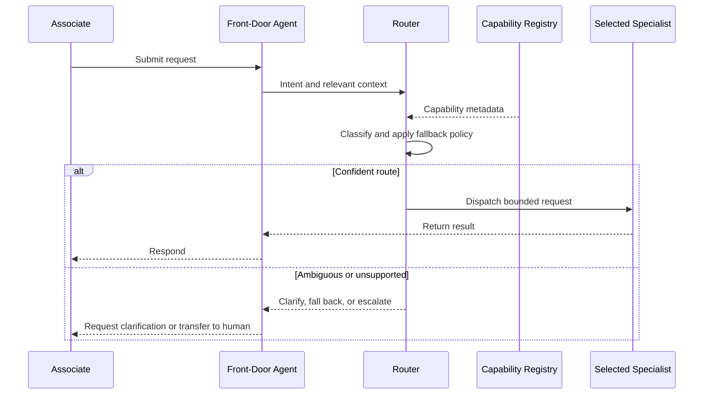

## Logical component architecture


## Control and state model

| Concern                 | Architecture decision                                                                              |
| ----------------------- | -------------------------------------------------------------------------------------------------- |
| **Control owner**       | The router or front-door agent owns the dispatch decision                                          |
| **Conversation owner**  | Usually the front-door agent; a true ownership transfer changes the primary pattern toward Handoff |
| **Session context**     | Conditional; required for conversational follow-ups and context-sensitive routing                  |
| **Capability registry** | Required; names, descriptions, input contracts, availability, policy, and destination              |
| **Shared state**        | Not typical; one specialist normally handles the request                                           |
| **Task ledger**         | Not typical for synchronous routing; conditional for asynchronous cases                            |
| **Long-term memory**    | Optional; may improve personalization but must not determine authorization                         |
| **Route audit**         | Production baseline for consequential or regulated routing                                         |

## Capability bill of materials

| Capability                               | Requirement     | Why                                                                                                               |
| ---------------------------------------- | --------------- | ----------------------------------------------------------------------------------------------------------------- |
| Capability metadata and registry         | **Required**    | The router needs an explicit set of destinations and selection metadata                                           |
| Classification or routing policy         | **Required**    | Produces the destination decision                                                                                 |
| Dispatch contract                        | **Required**    | Defines what context and inputs the destination receives                                                          |
| Structured route result                  | **Required**    | Supports destination, confidence, reason, and fallback behavior                                                   |
| Completion and fallback policy           | **Required**    | Handles no-match, ambiguity, unavailable capabilities, and unsupported requests                                   |
| Context minimization                     | **Conditional** | Required when specialists have different data boundaries                                                          |
| Multi-intent detection and policy        | **Required**    | Defines whether to clarify, reject, select a primary intent, or split the request when several destinations match |
| Multi-intent decomposition and execution | **Conditional** | Required only when several intents should be handled independently                                                |
| Human escalation                         | **Conditional** | Required for high-risk, low-confidence, or unsupported requests                                                   |
| Durable task state                       | **Conditional** | Required only when dispatch starts asynchronous work                                                              |
| Route evaluation set                     | **Conditional** | Needed to measure precision, recall, and confusion between similar capabilities                                   |
| Shared conversation                      | **Not typical** | A router selects a destination; it does not convene a discussion                                                  |
| Task ledger                              | **Not typical** | The router does not normally manage a multi-step plan                                                             |

## Minimum viable implementation

The smallest correct Router contains:

1. One front door or request endpoint
2. A registry containing at least two distinguishable capabilities
3. A classifier or deterministic policy
4. A bounded input contract for each destination
5. A policy for requests that match zero or several capabilities
6. A low-confidence fallback
7. A recorded route decision for testing

The minimum implementation can be sessionless and synchronous.

## Production additions

* Authenticated application session mapped to any provider continuation ID
* Tenant-aware capability filtering
* Route decision schema with confidence, policy version, and reason
* Custom correlation ID propagated to agents, workflows, state, and telemetry
* Availability and health checks before dispatch
* Circuit breaker and fallback behavior
* Evaluation dataset covering ambiguous, multi-intent, and adversarial requests
* Idempotency when dispatch causes side effects
* Human escalation for consequential routing

## Low-code realization


| Capability            | Implementation source                                                               | Maturity / gap                                                                         |
| --------------------- | ----------------------------------------------------------------------------------- | -------------------------------------------------------------------------------------- |
| Front-door experience | Copilot Studio **Native**                                                           | Stable classic surface; new experience is production-ready preview                     |
| Dynamic selection     | Generative orchestration **Native**                                                 | Selected capabilities are invoked sequentially                                         |
| Explicit routing      | Classic topics **Native**                                                           | Trigger and condition based                                                            |
| Capability registry   | Topic, tool, child-agent, and connected-agent metadata **Native**                   | Maker owns description quality and collisions                                          |
| Specialist boundary   | Child or connected agents **Native**                                                | Child agents share context; connected agents receive copied context and return results |
| Routing policy        | Instructions, descriptions, conditions, and fallback logic **Custom configuration** | No universal confidence threshold is supplied                                          |
| Route audit           | Dataverse **Platform-adjacent**                                                     | Recommended for consequential decisions                                                |
| Human fallback        | Copilot Studio human handoff or Power Automate **Platform-adjacent**                | Destination and channel constraints apply                                              |
| End-to-end tracing    | Analytics plus Application Insights **Native + Platform-adjacent**                  | Propagate a custom correlation ID across connected agents and flows                    |

### Low-code boundary

Copilot Studio is a strong native fit for Router. Do not call parent-to-connected-agent invocation a decentralized Handoff unless active conversational ownership actually transfers.

## Managed pro-code realization


| Capability                   | Implementation source                                                             | Maturity / gap                                                                             |
| ---------------------------- | --------------------------------------------------------------------------------- | ------------------------------------------------------------------------------------------ |
| Routing workflow             | Agent Framework conditional graph or routing agent **Native framework**           | Stable .NET/Python graph APIs                                                              |
| Managed endpoint and scaling | Foundry Agent Service **Native hosting**                                          | Agent Service GA                                                                           |
| Agent Framework Hosted agent | Foundry Hosted agents **Native hosting**                                          | Hosted-agent service GA; verify language-specific Agent Framework hosting package maturity |
| Conversation continuity      | Foundry conversation object **Native**                                            | Do not use as task or authorization state                                                  |
| Capability registry          | Application configuration, Dataverse, or Cosmos DB **Platform-adjacent / Custom** | Schema and tenant filtering remain application-owned                                       |
| Tools                        | Foundry Toolbox or MCP **Native service**                                         | Tool-specific maturity varies                                                              |
| Route audit                  | Dataverse or Cosmos DB **Platform-adjacent**                                      | Persist policy version and correlation                                                     |
| Tracing                      | Foundry tracing plus Application Insights **Native + Platform-adjacent**          | Foundry tracing is GA for prompt and Hosted agents                                         |

### Managed boundary

Agent Framework implements the Router. Foundry operates the endpoint and Hosted runtime. Foundry does not supply the application capability taxonomy or route policy.

## Custom code-first realization


| Capability                     | Implementation source                                                                       | Maturity / gap                                              |
| ------------------------------ | ------------------------------------------------------------------------------------------- | ----------------------------------------------------------- |
| Routing workflow               | Agent Framework conditional graph or routing agent **Native framework**                     | Stable .NET/Python graph APIs                               |
| Runtime                        | Functions, Container Apps, AKS, App Service, or another selected host **Platform-adjacent** | Operations boundary varies                                  |
| API protection                 | API Management or application gateway **Platform-adjacent**                                 | AI gateway feature maturity varies                          |
| Authorized session mapping     | Application database and API logic **Custom**                                               | Provider IDs must not be trusted as bearer authorization    |
| Capability registry and policy | Application schema and logic **Custom**                                                     | Version and evaluate independently                          |
| Specialist tools               | Functions, MCP services, or APIs **Platform-adjacent / Custom**                             | Apply least privilege                                       |
| Route audit                    | Dataverse, Cosmos DB, or SQL **Platform-adjacent**                                          | Use optimistic concurrency where decisions can be updated   |
| Observability                  | Agent Framework OpenTelemetry plus Application Insights **Native + Platform-adjacent**      | Correlate user, session, route, destination, and tool calls |

## Failure and termination behavior

| Failure                         | Required behavior                                                                               |
| ------------------------------- | ----------------------------------------------------------------------------------------------- |
| No destination matches          | Clarify, use a safe general capability, or escalate                                             |
| Several destinations match      | Apply a multi-intent policy or ask a discriminating question                                    |
| Destination unavailable         | Select an approved fallback or return a transparent failure                                     |
| Destination rejects context     | Minimize and reconstruct the bounded request                                                    |
| Destination times out           | Enforce timeout; retry only if safe; avoid selecting another side-effecting destination blindly |
| Route causes a duplicate action | Use an idempotency key and duplicate-outcome lookup                                             |

## Architecture cautions

* Selecting several specialists and synthesizing results is Parallel or Supervisor behavior, not simple routing.
* Transferring the active conversation to a peer is Handoff.
* A capability description is runtime policy and must be versioned and evaluated.
* Conversation history should be minimized before crossing security or domain boundaries.
* Routing accuracy normally degrades as capability descriptions become numerous or semantically similar.

## References

* [Copilot Studio generative orchestration](https://learn.microsoft.com/en-us/microsoft-copilot-studio/advanced-generative-actions)
* [Copilot Studio child and connected agents](https://learn.microsoft.com/en-us/microsoft-copilot-studio/authoring-add-other-agents)
* [Agent Framework workflow edges](https://learn.microsoft.com/en-us/agent-framework/workflows/edges)
* [Foundry Agent Service overview](https://learn.microsoft.com/en-us/azure/foundry/agents/overview)
* [Foundry Hosted agents](https://learn.microsoft.com/en-us/azure/foundry/agents/concepts/hosted-agents)

***

# Blueprint 2: Plan-and-Execute / Adaptive Replanning

> [Return to pattern selection guidance](agentic-patterns-architecture-position.md#6-pattern-cards)

## Pattern intent

A planner decomposes a long-horizon goal into tasks, executors perform bounded work, progress is evaluated, and the plan changes when observations, failures, dependencies, or external conditions change.

Magentic is a specialized adaptive planner and supervisor implementation in this family.

## Professional-services scenario

An associate relocating to another country requests end-to-end assistance. The system creates and maintains a plan across immigration, travel, payroll, tax, benefits, equipment, and local onboarding; tracks completed actions; and replans when the start date or visa status changes.

## Interaction sequence

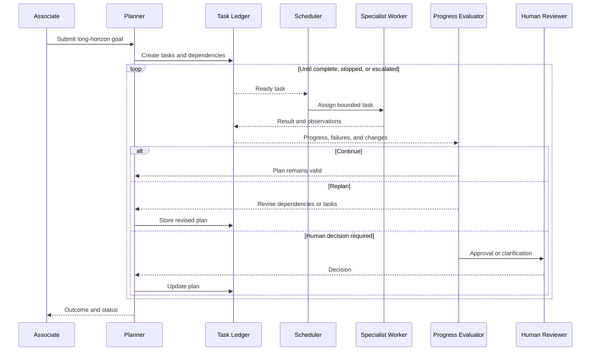

## Logical component architecture


## Control and state model

| Concern                    | Architecture decision                                                          |
| -------------------------- | ------------------------------------------------------------------------------ |
| **Control owner**          | Planner or planning manager                                                    |
| **Conversation owner**     | Planner-facing application or supervisor                                       |
| **Worker context**         | Private, bounded task context                                                  |
| **Shared working state**   | Structured observations and task results                                       |
| **Task ledger**            | Required authoritative plan, dependency, ownership, and progress record        |
| **Durable workflow state** | Conditional logically; production baseline for long-running work               |
| **Artifact workspace**     | Conditional; required when workers create documents or evidence                |
| **Long-term memory**       | Optional personalization or procedural recall; never the task ledger           |
| **Human state**            | Approval, clarification, timeout, and authorization stored before notification |

### Canonical task-ledger fields

| Field group        | Minimum fields                                                          |
| ------------------ | ----------------------------------------------------------------------- |
| Identity           | `workItemId`, `processId`, `parentWorkItemId`, `tenantId`, `workType`   |
| Lifecycle          | `status`, `createdAt`, `updatedAt`, `dueAt`, `completedAt`              |
| Ownership          | `assignedTo`, `leaseOwner`, `leaseExpiresAt`, `heartbeatAt`             |
| Reliability        | `attempt`, `maxAttempts`, `idempotencyKey`, `rowVersion` or `etag`      |
| Causality          | `commandId`, `messageId`, `correlationId`, `causationId`, `traceparent` |
| Inputs and outputs | Typed metadata plus immutable artifact references                       |
| Approval           | Approver, decision, decision time, comments, and policy version         |
| Failure            | Error class, retryability, and next-attempt time                        |
| Governance         | Agent/user IDs, security label, and retention class                     |
| Cost               | Provider, model, deployment, token categories, and estimated charge     |

## Capability bill of materials

| Capability                | Requirement             | Why                                                                             |
| ------------------------- | ----------------------- | ------------------------------------------------------------------------------- |
| Planner and replanner     | **Required**            | Creates and revises the task model                                              |
| Authoritative task ledger | **Required**            | Tracks dependencies, ownership, observations, and progress                      |
| Worker registry           | **Required**            | Allows the planner to select suitable executors                                 |
| Delegation contract       | **Required**            | Gives each worker a bounded task and result schema                              |
| Progress evaluator        | **Required**            | Decides continue, replan, stop, or escalate                                     |
| Completion policy         | **Required**            | Defines goal completion and terminal failure                                    |
| Hard limits               | **Required**            | Bounds rounds, stalls, resets, tokens, cost, and elapsed time                   |
| Structured worker outputs | **Required**            | Makes observations and completion state machine-readable                        |
| Shared working state      | **Required**            | Allows planner and evaluator to reason over progress                            |
| Durable runtime recovery  | **Production baseline** | Long-running work must survive restarts and waits                               |
| Retry and idempotency     | **Production baseline** | Worker execution and side effects can repeat                                    |
| End-to-end observability  | **Production baseline** | Operators need task, worker, tool, and replan causality                         |
| Concurrent execution      | **Conditional**         | Useful when ready tasks are independent                                         |
| Artifact workspace        | **Conditional**         | Required for documents, evidence, and large outputs                             |
| Human intervention        | **Conditional**         | Required for consequential approvals, missing information, or policy exceptions |
| Long-term memory          | **Optional**            | Can improve personalization or procedural reuse                                 |

## Minimum viable implementation

The smallest correct Plan-and-Execute implementation contains:

1. A planner that produces a structured task list
2. At least two bounded tasks or one task whose result can change the remaining plan
3. A task ledger, even if initially held in process memory
4. One or more executors
5. A progress evaluator
6. A replan path
7. Explicit completion and maximum-round rules

This minimum can run within one process. It is not production-durable.

## Production additions

* External authoritative task ledger
* Durable orchestration or checkpoint recovery
* Work-item leases and heartbeats
* Command queue and bounded worker concurrency
* Idempotency and duplicate-outcome lookup
* Inbox/outbox around state and messages
* Immutable artifact references and versions
* Persisted human approvals and callback correlation
* Compensation state for completed side effects
* Per-tenant budgets, quotas, and fairness
* Plan, task, worker, tool, and cost traces
* Versioned planner, worker registry, policy, and evaluation rubric

## Low-code realization


| Capability                   | Implementation source                                                          | Maturity / gap                                                                                                                           |
| ---------------------------- | ------------------------------------------------------------------------------ | ---------------------------------------------------------------------------------------------------------------------------------------- |
| Associate front door         | Copilot Studio **Native**                                                      | Stable classic surface; new experience is production-ready preview                                                                       |
| Dynamic capability selection | Copilot Studio orchestration **Native**                                        | Not a task-ledger planner or Magentic runtime                                                                                            |
| Planner/replanner            | Prompt, instructions, and flow logic **Custom configuration**                  | Application owns structured plan and replan policy                                                                                       |
| Task ledger                  | Dataverse **Platform-adjacent**                                                | Preferred authoritative low-code ledger                                                                                                  |
| Task execution               | Agent flows using the Run an agent node plus child/connected agents **Native** | A flow can invoke a published agent and wait for its result; agent-to-flow tool calls remain subject to the 100-second response contract |
| Long-running coordination    | Dataverse-triggered independent flows **Platform-adjacent**                    | Do not hold one agent call or flow run open indefinitely                                                                                 |
| Human decisions              | Power Automate Approvals **Platform-adjacent**                                 | One flow run, including pending approval, normally has a 30-day maximum                                                                  |
| Artifacts                    | SharePoint **Platform-adjacent**                                               | Use versioned libraries and store references in the ledger                                                                               |
| Runtime checkpoint           | Not supplied as an arbitrary agent-graph primitive                             | Reconstruct work from ledger and idempotent flows                                                                                        |
| New workflows                | Copilot Studio **Native**                                                      | Public preview; do not make them a silent production dependency                                                                          |

### Low-code boundary

Copilot Studio supplies the experience, specialists, and deterministic automation. The application must define the planner, task-ledger schema, replan policy, long-running correlation, and recovery behavior.

## Managed pro-code realization


| Capability                        | Implementation source                                                    | Maturity / gap                                                                                         |
| --------------------------------- | ------------------------------------------------------------------------ | ------------------------------------------------------------------------------------------------------ |
| Planner and workers               | Agent Framework Magentic or custom planner workflow **Native framework** | Python is stable; verify the exact .NET Magentic API because documentation and annotations conflict    |
| Managed host                      | Foundry Hosted agents **Native hosting**                                 | GA; verify language-specific Agent Framework hosting package maturity                                  |
| Conversation continuity           | Foundry conversation state **Native**                                    | Not the authoritative task ledger                                                                      |
| Task ledger                       | Dataverse or Cosmos DB **Platform-adjacent**                             | Store ownership, dependencies, attempts, and approvals                                                 |
| Durable long-running coordination | Durable Functions or Durable Task **Platform-adjacent**                  | Separate from Foundry Hosted-agent execution                                                           |
| Agent Framework Durable Extension | Agent Framework integration **Platform-adjacent**                        | Preview/prerelease; runs on Functions or self-hosted compute, not automatically inside Foundry hosting |
| Artifacts                         | Blob Storage or SharePoint **Platform-adjacent**                         | Hosted session files are preview, session-scoped, and not a shared workspace                           |
| Human decisions                   | Approval/callback service **Platform-adjacent**                          | Persist request before notification                                                                    |
| Tools                             | Foundry Toolbox/MCP **Native service**                                   | Tool-specific maturity varies                                                                          |
| Tracing                           | Foundry tracing plus Application Insights **Native + Platform-adjacent** | Tracing is GA for prompt and Hosted agents                                                             |

### Managed boundary

Agent Framework supplies planning behavior; Foundry supplies managed hosting. Neither Foundry conversation state, managed memory, nor Hosted session files replace the operational task ledger or durable workflow runtime.

## Custom code-first realization


| Capability                  | Implementation source                                                                  | Maturity / gap                                                        |
| --------------------------- | -------------------------------------------------------------------------------------- | --------------------------------------------------------------------- |
| Planner, workers, evaluator | Agent Framework **Native framework**                                                   | Stable core .NET/Python; feature maturity varies                      |
| Runtime                     | Functions, Container Apps, AKS, App Service, or another host **Platform-adjacent**     | Application team owns scaling and lifecycle                           |
| Durable orchestration       | Durable Task SDK and Scheduler **Platform-adjacent**                                   | .NET/Python/Java GA; JavaScript/TypeScript preview at research cutoff |
| Task ledger                 | Cosmos DB, SQL, or Dataverse **Platform-adjacent**                                     | Choose partition and transaction boundaries deliberately              |
| Work distribution           | Service Bus **Platform-adjacent**                                                      | Commands are at least once; use idempotent handlers                   |
| Artifacts                   | Blob Storage **Platform-adjacent**                                                     | Store immutable version references in the ledger                      |
| Human callbacks             | Application API, Teams, or approval service **Platform-adjacent / Custom**             | Authenticate responder and apply optimistic concurrency               |
| Reliability policy          | Idempotency, inbox/outbox, compensation **Custom**                                     | No platform supplies universal exactly-once side effects              |
| API governance              | API Management AI gateway capabilities **Platform-adjacent**                           | Apply model quotas, authentication, and token telemetry               |
| Observability               | Agent Framework OpenTelemetry plus Application Insights **Native + Platform-adjacent** | Propagate business and trace causality explicitly                     |

## Failure and termination behavior

| Failure                                          | Required behavior                                                     |
| ------------------------------------------------ | --------------------------------------------------------------------- |
| Planner creates invalid or circular dependencies | Validate task graph before scheduling                                 |
| No worker can handle a task                      | Replan, request human assignment, or terminate transparently          |
| Worker times out                                 | Record attempt, release or expire lease, and apply retry policy       |
| Worker repeats a side effect                     | Use idempotency key and duplicate-outcome lookup                      |
| Observation invalidates later tasks              | Mark affected tasks obsolete and record a new plan version            |
| Human response never arrives                     | Apply timeout, reminder, escalation, or terminal policy               |
| Budget or round limit reached                    | Stop safely and return partial status rather than silently continuing |
| Orchestrator restarts                            | Restore runtime state or reconstruct from the authoritative ledger    |
| Artifact changes after review                    | Pin version or content hash in the task result                        |

## Architecture cautions

* Dynamic tool or agent selection without a task ledger and replanning loop is not Plan-and-Execute.
* A transcript, checkpoint, or long-term memory store is not the authoritative task ledger.
* Foundry managed hosting does not automatically provide durable distributed orchestration.
* Durable Task history is execution state, not the business plan or audit record.
* Workers must receive bounded context; sharing the full planner history increases cost and data exposure.
* Replanning must version or invalidate prior tasks rather than silently overwriting history.
* External side effects remain at-least-once unless the application implements stronger controls.

## References

* [Agent Framework Magentic orchestration](https://learn.microsoft.com/en-us/agent-framework/workflows/orchestrations/magentic)
* [Agent Framework Harness](https://learn.microsoft.com/en-us/agent-framework/agents/harness)
* [Agent Framework workflow state](https://learn.microsoft.com/en-us/agent-framework/workflows/state)
* [Agent Framework checkpoints](https://learn.microsoft.com/en-us/agent-framework/workflows/checkpoints)
* [Agent Framework Durable Extension](https://learn.microsoft.com/en-us/agent-framework/integrations/durable-extension)
* [Foundry Hosted agents](https://learn.microsoft.com/en-us/azure/foundry/agents/concepts/hosted-agents)
* [Durable Functions overview](https://learn.microsoft.com/en-us/azure/durable-task/durable-functions/durable-functions-overview)
* [Durable Task SDK and Scheduler](https://learn.microsoft.com/en-us/azure/durable-task/common/choose-orchestration-framework)
* [Dataverse overview](https://learn.microsoft.com/en-us/power-apps/maker/data-platform/data-platform-intro)
* [Copilot Studio agent node in agent flows](https://learn.microsoft.com/en-us/microsoft-copilot-studio/agent-node-workflow)
* [Service Bus overview](https://learn.microsoft.com/en-us/azure/service-bus-messaging/service-bus-messaging-overview)

***

# Blueprint 3: Sequential Pipeline

> [Return to pattern selection guidance](agentic-patterns-architecture-position.md#6-pattern-cards)

## Pattern intent

A Sequential Pipeline moves work through a predetermined series of stages. Each stage consumes a bounded, validated output from the preceding stage; ordered stage contracts, rather than dynamic routing or lifecycle branching, define the pattern.

## Professional-services scenario

An associate describes an ambiguous travel-expense situation in free text. One specialist identifies the relevant facts and missing evidence, a second reconciles travel and expense policy, a third develops context-sensitive guidance, and a final stage converts the result into associate instructions and a case note. If these roles do not require distinct reasoning, ownership, or reuse, implement the same path as a deterministic workflow or single agent instead.

## Interaction sequence

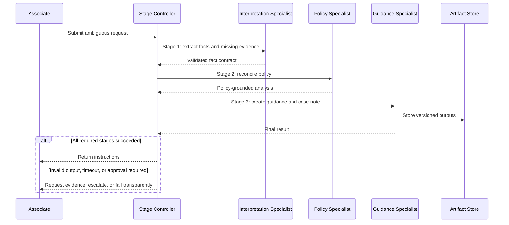

## Logical component architecture


## Control and state model

| Concern                          | Owner                                 | Scope and boundary                                            | Lifetime / durability                                       |
| -------------------------------- | ------------------------------------- | ------------------------------------------------------------- | ----------------------------------------------------------- |
| **Control owner**                | Ordered stage controller              | Selects the next fixed stage and validates each handoff       | One pipeline run; persist when the run can wait or restart  |
| **Session context**              | Request interface or agent runtime    | Associate dialogue only; not stage progress                   | Conditional; interaction lifetime                           |
| **Agent-private working state**  | Individual stage                      | Intermediate reasoning is isolated from other stages          | Optional and normally stage-scoped                          |
| **Shared conversation state**    | None                                  | Stages exchange contracts, not a common transcript            | Not typical                                                 |
| **Shared working state**         | Stage-result store                    | Versioned facts and outputs intentionally passed downstream   | Conditional; run lifetime or retained case evidence         |
| **Workflow state / checkpoints** | Workflow runtime and checkpoint store | Current stage, attempts, waits, and restorable executor state | Conditional; durable for long-running or interruptible work |
| **Task ledger**                  | None                                  | A fixed stage sequence does not require a business task plan  | Not typical                                                 |
| **Long-term memory**             | Separate memory service               | Optional preferences or procedural recall; never stage truth  | Optional and cross-session                                  |
| **Artifacts**                    | Document or object store              | Instructions, evidence, and case-note versions                | Conditional; business retention period                      |
| **Telemetry**                    | Observability platform                | Stage latency, model/tool use, failures, and correlation      | Operational retention; not business truth                   |

## Capability bill of materials

| Capability                  | Requirement     | Why                                                                         |
| --------------------------- | --------------- | --------------------------------------------------------------------------- |
| Session context             | **Conditional** | Needed for conversational clarification or follow-up                        |
| Agent-private state         | **Optional**    | A stage can keep isolated intermediate reasoning                            |
| Shared conversation         | **Not typical** | Ordered contracts, not deliberation, connect stages                         |
| Shared working state        | **Conditional** | Needed when stage outputs must be inspected or resumed                      |
| Durable workflow state      | **Conditional** | Required for long waits, interruption, or restart                           |
| Task ledger                 | **Not typical** | The known sequence is not a dynamic task plan                               |
| Long-term memory            | **Optional**    | Can personalize guidance without holding process truth                      |
| Artifact workspace          | **Conditional** | Required for evidence, instructions, or case notes                          |
| Context transfer            | **Required**    | Every downstream stage needs the preceding stage's bounded result           |
| Capability routing          | **Not typical** | Stage order is predetermined                                                |
| Delegation tracking         | **Not typical** | There is no dynamic manager-worker assignment model                         |
| Ownership transfer          | **Not typical** | Control remains with the pipeline                                           |
| Concurrent scheduling       | **Not typical** | Dependent stages execute in order                                           |
| Fan-in aggregation          | **Not typical** | No parallel branches are merged                                             |
| Turn / speaker management   | **Not typical** | There is no shared discussion                                               |
| Events / human intervention | **Conditional** | Needed for approvals, missing evidence, or asynchronous continuation        |
| Structured stage contracts  | **Conditional** | Required when reliable validation or automation depends on typed outputs    |
| Evaluation rubric           | **Optional**    | Can quality-check stage or final outputs                                    |
| Conflict resolution         | **Not typical** | One ordered result feeds each next stage                                    |
| Completion policy           | **Required**    | Defines successful final stage and terminal failure                         |
| Hard limits                 | **Conditional** | Required when stages can retry, loop locally, or consume variable resources |

## Minimum viable implementation

The smallest correct implementation contains:

1. A controller with a fixed order of at least two dependent stages
2. A defined input and output contract at every stage boundary
3. Validation before advancing
4. A terminal success state and explicit stage-failure behavior
5. Bounded context transfer rather than an implicit shared transcript

It can run synchronously in one process and keep stage outputs in memory. It does not need a task ledger, distributed queue, or durable checkpoint runtime.

## Production additions

* Externalize large or regulated stage outputs and pin artifact versions.
* Persist current stage, attempts, waits, and correlation when execution can outlive one request.
* Apply per-stage timeout, retry classification, circuit breaking, and fallback.
* Persist intent before side effects; use idempotency keys and duplicate-outcome lookup.
* Compensate completed side effects when a later stage makes the overall transaction invalid.
* Redact and minimize context at every domain boundary.
* Version stage schemas, prompts, policies, and evaluation sets.
* Trace end-to-end stage causality, latency, tokens, cost, and failure class.
* Add authenticated approval and escalation paths where policy requires them.

## Low-code realization


| Capability                     | Implementation source                                                             | Maturity / gap                                                                                                         |
| ------------------------------ | --------------------------------------------------------------------------------- | ---------------------------------------------------------------------------------------------------------------------- |
| Ordered controller             | Classic topics or agent flows **Native**                                          | Stable; maker owns sequence and branch conditions                                                                      |
| Model-selected sequence        | Generative orchestration **Native**                                               | Stable; selected capabilities are invoked sequentially, but order remains model-directed                               |
| New workflows option           | Copilot Studio workflows **Native**                                               | Public preview; optional, not a silent dependency                                                                      |
| Stage agents and tools         | Copilot Studio topics, tools, child agents, or connected agents **Native**        | Capability-specific maturity varies                                                                                    |
| Session context                | Copilot Studio conversation context **Native**                                    | Interaction state only; not recoverable workflow truth                                                                 |
| Stage contracts and validation | Instructions, variables, schemas, and flow conditions **Custom configuration**    | Application owns compatibility and invalid-output handling                                                             |
| Shared stage state             | Dataverse **Platform-adjacent**                                                   | GA; use row-version concurrency where updates can race                                                                 |
| Long-running coordination      | Power Automate or Logic Apps **Platform-adjacent**                                | Stable; agent-to-flow calls must return within the documented 100-second contract and flow duration limits still apply |
| Artifacts                      | SharePoint or Dataverse file columns **Platform-adjacent**                        | Stable; store immutable version references with stage state                                                            |
| Observability                  | Copilot Studio analytics plus Application Insights **Native + Platform-adjacent** | Propagate a business correlation ID through every stage                                                                |

### Low-code boundary

Copilot Studio natively supports fixed topic and agent-flow sequences, and generative orchestration calls selected capabilities sequentially. Dataverse or another workflow service owns recoverable stage state when the pipeline cannot remain inside one bounded invocation.

## Managed pro-code realization


| Capability                          | Implementation source                                                     | Maturity / gap                                                                             |
| ----------------------------------- | ------------------------------------------------------------------------- | ------------------------------------------------------------------------------------------ |
| Sequential orchestration            | Agent Framework Sequential orchestration **Native framework**             | Stable .NET/Python                                                                         |
| Managed endpoint and scaling        | Foundry Agent Service **Native hosting**                                  | Agent Service GA                                                                           |
| Agent Framework Hosted agent        | Foundry Hosted agents **Native hosting**                                  | Hosted-agent service GA; verify language-specific Agent Framework hosting package maturity |
| Conversation continuity             | Foundry conversation state **Native service**                             | Not workflow position, business truth, or authorization                                    |
| Standard checkpoints                | Agent Framework checkpoints **Native framework**                          | Stable; separate from the Durable Extension                                                |
| Production checkpoint store         | Cosmos DB or application-selected provider **Platform-adjacent / Custom** | Provider coverage varies by language                                                       |
| Distributed long-running execution  | Durable Functions or Durable Task **Platform-adjacent**                   | Separate from Foundry hosting; use only when required                                      |
| Stage schemas and completion policy | Application-owned workflow configuration **Custom**                       | Version and test independently                                                             |
| Artifacts                           | Blob Storage or SharePoint **Platform-adjacent**                          | Hosted session files are preview and are not the durable artifact system                   |
| Tracing                             | Foundry tracing plus Application Insights **Native + Platform-adjacent**  | Foundry tracing is GA for prompt and Hosted agents                                         |

### Managed boundary

Agent Framework implements the ordered pipeline; GA Foundry Hosted agents provide managed hosting. Verify language-specific Agent Framework hosting package maturity. Foundry conversation state does not replace workflow checkpoints, stage records, or artifacts. Durable distributed execution, when needed, remains a separate adjacent capability.

## Custom code-first realization


| Capability                                  | Implementation source                                                                  | Maturity / gap                                                |
| ------------------------------------------- | -------------------------------------------------------------------------------------- | ------------------------------------------------------------- |
| Sequential orchestration                    | Agent Framework Sequential orchestration or graph edges **Native framework**           | Stable .NET/Python                                            |
| Runtime                                     | Functions, Container Apps, AKS, App Service, or another host **Platform-adjacent**     | Application team owns scaling and lifecycle                   |
| API and authorized session mapping          | API Management plus application API/state **Platform-adjacent + Custom**               | Never use a provider continuation ID as bearer authorization  |
| Stage contracts, validation, and completion | Application schema and policy **Custom**                                               | Must be versioned and regression-tested                       |
| Checkpoint store                            | Cosmos DB, SQL, or another provider **Platform-adjacent**                              | Choose transaction and tenant boundaries deliberately         |
| Durable execution                           | Durable Task Scheduler or Durable Functions **Platform-adjacent**                      | Conditional; runtime history is not a business ledger         |
| Tools                                       | Functions, MCP services, or APIs **Platform-adjacent / Custom**                        | Apply least privilege and per-stage authorization             |
| Artifacts                                   | Blob Storage **Platform-adjacent**                                                     | Pin immutable versions in stage results                       |
| Reliability                                 | Idempotency, inbox/outbox, and compensation **Custom**                                 | External side effects are not universally exactly once        |
| Observability                               | Agent Framework OpenTelemetry plus Application Insights **Native + Platform-adjacent** | Correlate request, stage, attempt, tool, and artifact version |

## Failure and termination behavior

| Failure or terminal condition                | Required behavior                                                                                             |
| -------------------------------------------- | ------------------------------------------------------------------------------------------------------------- |
| Stage returns invalid output                 | Reject it, record validation details, and retry only within a hard attempt limit                              |
| Stage times out or is unavailable            | Apply the stage-specific retry/fallback policy or terminate transparently                                     |
| Earlier-stage error is discovered downstream | Stop advancement; return to an explicitly allowed correction point rather than silently mutating prior output |
| Context exceeds a downstream boundary        | Summarize and reconstruct the typed contract; do not forward the full transcript by default                   |
| Side effect is retried                       | Reuse the idempotency key and look up any prior outcome                                                       |
| Human decision is pending                    | Persist request and correlation before notification; enforce reminder and timeout policy                      |
| Final stage succeeds                         | Mark the run complete and pin exact output/artifact versions                                                  |
| Cost, time, or attempt limit is reached      | Stop safely and return partial status plus the failed stage                                                   |

## Architecture cautions

* Branching among lifecycle states makes Conditional Graph / State Machine the primary pattern.
* Independent concurrent branches plus a merge are Parallel Fan-Out/Fan-In.
* Dynamic worker selection and synthesis by a retained manager are Supervisor behavior.
* A chain of model calls is not justified when one agent or a deterministic transformation provides equivalent separation.
* Passing full conversation history between stages weakens isolation and hides the real stage contract.
* Workflow history and checkpoints must not be presented as a business task ledger.

## Official references

* [Agent Framework orchestration patterns](https://learn.microsoft.com/en-us/agent-framework/workflows/orchestrations/)
* [Agent Framework workflow state](https://learn.microsoft.com/en-us/agent-framework/workflows/state)
* [Agent Framework checkpoints](https://learn.microsoft.com/en-us/agent-framework/workflows/checkpoints)
* [Copilot Studio generative orchestration](https://learn.microsoft.com/en-us/microsoft-copilot-studio/advanced-generative-actions)
* [Copilot Studio agent flows](https://learn.microsoft.com/en-us/microsoft-copilot-studio/flows-overview)
* [Copilot Studio new workflows](https://learn.microsoft.com/en-us/microsoft-copilot-studio/workflows-experience/flows-overview)
* [Power Automate limits](https://learn.microsoft.com/en-us/power-automate/limits-and-config)
* [Foundry Hosted agents](https://learn.microsoft.com/en-us/azure/foundry/agents/concepts/hosted-agents)

***

# Blueprint 4: Parallel Fan-Out/Fan-In

> [Return to pattern selection guidance](agentic-patterns-architecture-position.md#6-pattern-cards)

## Pattern intent

Parallel Fan-Out/Fan-In starts independent branches without waiting for sibling branches, isolates their working context, and applies an explicit barrier and aggregation policy. Concurrency without a defined merge, quorum, or partial-result policy is not a complete implementation of the pattern.

## Professional-services scenario

Before an international assignment, travel, immigration, security, tax, and expense specialists independently identify associate obligations. An aggregator produces one prioritized readiness checklist.

## Interaction sequence

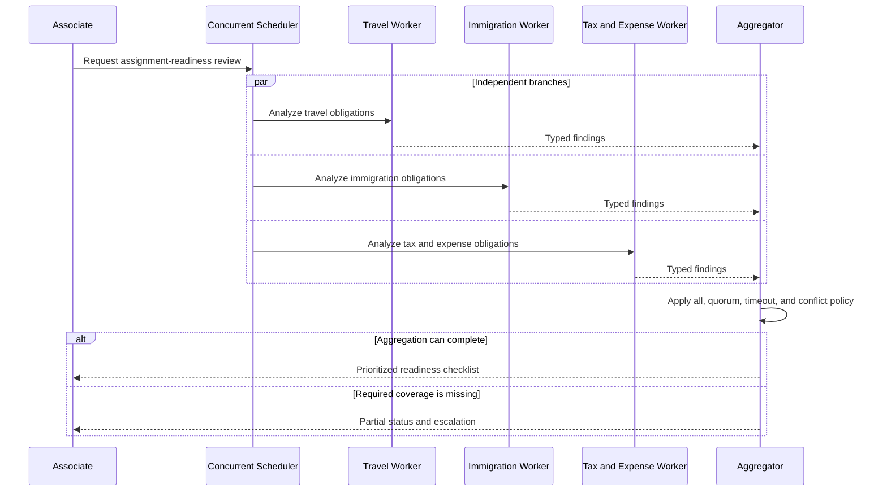

## Logical component architecture


## Control and state model

| Concern                          | Owner                                                    | Scope and boundary                                                | Lifetime / durability                                               |
| -------------------------------- | -------------------------------------------------------- | ----------------------------------------------------------------- | ------------------------------------------------------------------- |
| **Control owner**                | Concurrent scheduler until fan-out; aggregator at fan-in | Starts bounded independent branches and enforces barrier policy   | One fan-out run; persist for distributed or interruptible execution |
| **Session context**              | Request interface                                        | Source request and final response only                            | Conditional; interaction lifetime                                   |
| **Agent-private working state**  | Each branch worker                                       | Isolated from sibling branches before aggregation                 | Required; branch lifetime                                           |
| **Shared conversation state**    | None                                                     | Workers do not deliberate in one transcript                       | Not typical                                                         |
| **Shared working state**         | Structured branch-result store                           | Results become shared only at the aggregation boundary            | Conditional; run lifetime                                           |
| **Workflow state / checkpoints** | Concurrency runtime                                      | Branch IDs, pending/completed status, timeout, and barrier state  | Conditional; durable for distributed or long-running work           |
| **Task ledger**                  | None                                                     | Fixed branches are not a dynamic business task plan               | Not typical                                                         |
| **Long-term memory**             | Separate memory service                                  | Optional personalization; never branch completion state           | Optional and cross-session                                          |
| **Artifacts**                    | Document or object store                                 | Branch evidence and aggregated checklist                          | Conditional; business retention period                              |
| **Telemetry**                    | Observability platform                                   | Per-branch causality, latency, usage, stragglers, and aggregation | Operational retention; not result truth                             |

## Capability bill of materials

| Capability                  | Requirement     | Why                                                                    |
| --------------------------- | --------------- | ---------------------------------------------------------------------- |
| Session context             | **Conditional** | Needed when request and response are conversational                    |
| Agent-private state         | **Required**    | Prevents branches from contaminating one another before fan-in         |
| Shared conversation         | **Not typical** | Independent workers do not share a live discussion                     |
| Shared working state        | **Conditional** | Needed for durable result collection or inspection                     |
| Durable workflow state      | **Conditional** | Required when branches are distributed, long-running, or resumable     |
| Task ledger                 | **Not typical** | The branch set is fixed rather than adaptively planned                 |
| Long-term memory            | **Optional**    | Can personalize analysis but cannot record branch truth                |
| Artifact workspace          | **Conditional** | Required for evidence or large branch outputs                          |
| Context transfer            | **Required**    | Every worker needs a bounded request or partition                      |
| Capability routing          | **Conditional** | Required when branch capabilities are selected from a registry         |
| Delegation tracking         | **Conditional** | Required for asynchronous assignments, leases, or retries              |
| Ownership transfer          | **Not typical** | The scheduler and aggregator retain control                            |
| Concurrent scheduling       | **Required**    | Independent work must overlap in execution                             |
| Fan-in aggregation          | **Required**    | Produces the combined result and handles incomplete branches           |
| Turn / speaker management   | **Not typical** | There is no shared conversation                                        |
| Events / human intervention | **Conditional** | Needed for asynchronous completion, exceptions, or high-risk conflicts |
| Structured branch contracts | **Required**    | Makes aggregation and missing-result detection reliable                |
| Evaluation rubric           | **Conditional** | Needed for ranking, scoring, or quality-based selection                |
| Conflict resolution         | **Conditional** | Required when findings can disagree                                    |
| Completion policy           | **Required**    | Defines all, quorum, partial, timeout, or fail-fast behavior           |
| Hard limits                 | **Conditional** | Bounds branch count, concurrency, latency, tokens, and cost            |

## Minimum viable implementation

The smallest correct implementation contains:

1. A fixed split into at least two independent branches
2. Concurrent scheduling rather than sequential invocation
3. Isolated branch context
4. A typed result contract
5. A barrier or completion policy
6. An aggregator that handles missing and conflicting results

It can run in one process with an in-memory result collection. A sequential loop over workers does not satisfy the defining capability.

## Production additions

* Bound fan-out width and apply downstream backpressure and per-tenant fairness.
* Assign branch and correlation IDs and propagate them through tools, stores, and traces.
* Persist branch state and aggregation decisions when a process can restart.
* Use durable commands, leases, and dead-letter handling for distributed workers.
* Define fail-fast versus continue, quorum, straggler cancellation, and late-result policy.
* Apply idempotency and duplicate-outcome lookup to every retried branch and side effect.
* Pin input and artifact versions so every branch evaluates the same source.
* Version aggregation, ranking, tie-break, and conflict policies.
* Monitor peak concurrency, model quotas, latency distribution, cost, and partial-result rates.

## Low-code realization


| Capability                                 | Implementation source                                                             | Maturity / gap                                                                |
| ------------------------------------------ | --------------------------------------------------------------------------------- | ----------------------------------------------------------------------------- |
| Associate experience and specialist agents | Copilot Studio **Native**                                                         | Stable classic surface; capability maturity varies                            |
| Generative orchestration                   | Copilot Studio **Native**                                                         | Calls selected capabilities sequentially; it is not true fan-out              |
| Concurrent scheduler                       | Power Automate parallel branches or Logic Apps **Platform-adjacent**              | Stable workflow composition; concurrency limits and connector throttles apply |
| Agent invocation from flow                 | Run an agent node or agent endpoint **Native + Platform-adjacent**                | Bounded invocation; honor response and duration limits                        |
| Branch state                               | Dataverse **Platform-adjacent**                                                   | GA; use one branch identity and optimistic concurrency                        |
| Aggregator                                 | Flow logic **Platform-adjacent + Custom configuration**                           | Maker owns barrier, quorum, timeout, and partial-result semantics             |
| Result and conflict contracts              | Application schema and policy **Custom**                                          | No universal merge policy is supplied                                         |
| Artifacts                                  | SharePoint **Platform-adjacent**                                                  | Pin source and result versions                                                |
| Human exception                            | Power Automate Approvals **Platform-adjacent**                                    | Persist branch and approval state before notification                         |
| Observability                              | Copilot Studio analytics plus Application Insights **Native + Platform-adjacent** | Carry one parent correlation plus one branch ID                               |

### Low-code boundary

Copilot Studio supplies the experience and worker capabilities. True concurrency is flow-composed or external; native generative orchestration remains sequential. The flow and application own the barrier, aggregation, backpressure, and partial-failure policy.

## Managed pro-code realization


| Capability                   | Implementation source                                                          | Maturity / gap                                                                             |
| ---------------------------- | ------------------------------------------------------------------------------ | ------------------------------------------------------------------------------------------ |
| Concurrent orchestration     | Agent Framework Concurrent orchestration or fan-out graph **Native framework** | Stable .NET/Python                                                                         |
| Managed endpoint and scaling | Foundry Agent Service **Native hosting**                                       | Agent Service GA                                                                           |
| Agent Framework Hosted agent | Foundry Hosted agents **Native hosting**                                       | Hosted-agent service GA; verify language-specific Agent Framework hosting package maturity |
| Worker isolation             | Agent Framework executors and sessions **Native framework**                    | Stable; application still controls data boundaries                                         |
| Aggregator                   | Agent Framework executor plus application policy **Native + Custom**           | Aggregation semantics remain application-owned                                             |
| Branch checkpoint store      | Cosmos DB or application-selected provider **Platform-adjacent / Custom**      | Conditional; provider coverage varies                                                      |
| Distributed durable fan-out  | Durable Functions or Durable Task **Platform-adjacent**                        | Separate from Foundry hosting and conversation state                                       |
| Distributed command queue    | Service Bus **Platform-adjacent**                                              | Conditional; delivery is at least once                                                     |
| Artifacts                    | Blob Storage or SharePoint **Platform-adjacent**                               | Foundry session files are not a multi-writer result workspace                              |
| Tracing                      | Foundry tracing plus Application Insights **Native + Platform-adjacent**       | Correlate parent, branch, worker, tool, and aggregate                                      |

### Managed boundary

Agent Framework implements concurrent scheduling and aggregation; GA Foundry Hosted agents supply managed execution. Verify language-specific Agent Framework hosting package maturity. Use a separate durable runtime or queue only when the work crosses process or time boundaries. Foundry conversation state is not branch state or an aggregation ledger.

## Custom code-first realization


| Capability                             | Implementation source                                                                  | Maturity / gap                                                              |
| -------------------------------------- | -------------------------------------------------------------------------------------- | --------------------------------------------------------------------------- |
| Concurrent graph and aggregator        | Agent Framework **Native framework**                                                   | Stable core .NET/Python                                                     |
| Runtime                                | Container Apps, AKS, Functions, App Service, or another host **Platform-adjacent**     | Application team owns worker scaling and shutdown                           |
| Work distribution                      | Service Bus **Platform-adjacent**                                                      | Use commands, sessions where ordering matters, DLQ, and idempotent handlers |
| Durable fan-out/fan-in                 | Durable Task Scheduler or Durable Functions **Platform-adjacent**                      | Conditional; execution history is not business truth                        |
| Branch and barrier state               | Cosmos DB, SQL, or checkpoint provider **Platform-adjacent**                           | Choose partition and compare-and-set boundaries deliberately                |
| Contracts, quorum, and conflict policy | Application schema and logic **Custom**                                                | Version separately from worker prompts                                      |
| Backpressure and admission control     | Runtime plus application policy **Custom**                                             | Enforce branch, tenant, model, and downstream limits                        |
| Artifacts                              | Blob Storage **Platform-adjacent**                                                     | Store immutable references rather than bytes in result rows                 |
| API governance                         | API Management AI gateway capabilities **Platform-adjacent**                           | Apply authentication, quotas, and model telemetry                           |
| Observability                          | Agent Framework OpenTelemetry plus Application Insights **Native + Platform-adjacent** | Preserve parent/branch causality across queues                              |

## Failure and termination behavior

| Failure or terminal condition            | Required behavior                                                                       |
| ---------------------------------------- | --------------------------------------------------------------------------------------- |
| One branch returns invalid output        | Mark that branch failed; retry only under its policy and do not corrupt sibling results |
| One branch times out                     | Apply all/quorum/partial policy and cancel or ignore late work explicitly               |
| Worker or message is duplicated          | Deduplicate by branch and attempt; return the prior outcome when available              |
| Aggregator receives conflicting findings | Apply the versioned conflict policy, preserve provenance, or escalate                   |
| Aggregator restarts                      | Restore pending/completed branch state or reconstruct it from durable records           |
| Downstream service throttles             | Stop admitting work, reduce concurrency, and honor retry-after signals                  |
| Required coverage cannot be reached      | Terminate with partial findings and named missing branches                              |
| Barrier succeeds                         | Freeze the accepted branch set and aggregate exact result versions                      |
| Cost, time, or branch limit is reached   | Stop new work and apply the documented partial-result policy                            |

## Architecture cautions

* Sequentially calling several specialists and then merging does not provide parallel latency or concurrency semantics.
* A dynamic manager that decides what work to create is Supervisor or Plan-and-Execute, not fixed fan-out.
* The aggregator is a control component, not merely a final summarization prompt.
* Do not let late branch results silently alter an already-issued decision.
* Event Grid announces changes; it is not a command queue or aggregation barrier.
* Durable orchestration history is execution evidence, not a business task ledger.

## Official references

* [Agent Framework orchestration patterns](https://learn.microsoft.com/en-us/agent-framework/workflows/orchestrations/)
* [Agent Framework checkpoints](https://learn.microsoft.com/en-us/agent-framework/workflows/checkpoints)
* [Copilot Studio generative orchestration](https://learn.microsoft.com/en-us/microsoft-copilot-studio/advanced-generative-actions)
* [Copilot Studio agent node in agent flows](https://learn.microsoft.com/en-us/microsoft-copilot-studio/agent-node-workflow)
* [Durable Functions fan-out/fan-in](https://learn.microsoft.com/en-us/azure/azure-functions/durable/durable-functions-cloud-backup)
* [Durable Task hosting guidance](https://learn.microsoft.com/en-us/azure/durable-task/common/choose-orchestration-framework)
* [Service Bus overview](https://learn.microsoft.com/en-us/azure/service-bus-messaging/service-bus-messaging-overview)
* [Foundry Hosted agents](https://learn.microsoft.com/en-us/azure/foundry/agents/concepts/hosted-agents)

***

# Blueprint 5: Supervisor / Manager-Worker

> [Return to pattern selection guidance](agentic-patterns-architecture-position.md#6-pattern-cards)

## Pattern intent

A Supervisor retains the active conversation and accountability for the final result, dynamically selects specialists, delegates bounded assignments, receives their results, resolves gaps or conflicts, and synthesizes one response. Fixed fan-out alone is not supervision, and adaptive task-ledger planning is a separate specialization.

## Professional-services scenario

An associate planning parental leave asks one assistant for an action plan. The supervisor consults benefits, staffing, time-entry, travel, and policy specialists, then produces one sequenced plan while retaining the conversation.

## Interaction sequence

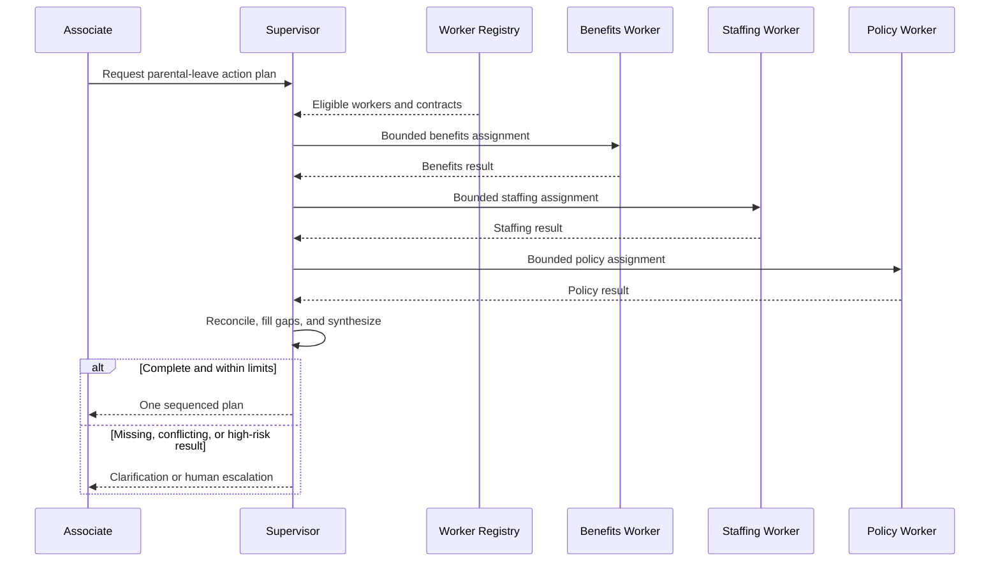

## Logical component architecture


## Control and state model

| Concern                          | Owner                              | Scope and boundary                                                  | Lifetime / durability                                           |
| -------------------------------- | ---------------------------------- | ------------------------------------------------------------------- | --------------------------------------------------------------- |
| **Control owner**                | Central supervisor                 | Selects workers, issues bounded assignments, and owns synthesis     | Entire request; durable when delegation outlives one invocation |
| **Session context**              | Supervisor runtime                 | Associate dialogue and supervisor reasoning context                 | Required; interaction lifetime                                  |
| **Agent-private working state**  | Each worker                        | Worker sees only its assignment and authorized evidence             | Required; assignment lifetime                                   |
| **Shared conversation state**    | Supervisor or conversation manager | Optional common history; workers normally receive minimized context | Optional; request lifetime                                      |
| **Shared working state**         | Supervisor result store            | Structured worker results, conflicts, and synthesis decisions       | Conditional; request or case lifetime                           |
| **Workflow state / checkpoints** | Workflow runtime                   | Pending delegations, waits, attempts, and resume position           | Conditional; durable for asynchronous work                      |
| **Task ledger**                  | Business store                     | Assignment ownership and outcomes for complex or long-running work  | Conditional; business retention period                          |
| **Long-term memory**             | Separate memory service            | Optional preferences or procedural recall                           | Optional and cross-session; never delegation truth              |
| **Artifacts**                    | Document or object store           | Evidence and final sequenced plan                                   | Conditional; business retention period                          |
| **Telemetry**                    | Observability platform             | Delegation, worker, tool, synthesis, latency, and cost traces       | Operational retention                                           |

## Capability bill of materials

| Capability                                 | Requirement     | Why                                                                  |
| ------------------------------------------ | --------------- | -------------------------------------------------------------------- |
| Session context                            | **Required**    | The supervisor retains the associate interaction                     |
| Agent-private state                        | **Required**    | Workers need isolated instructions, tools, and context               |
| Shared conversation                        | **Optional**    | Useful only when workers must inspect selected common history        |
| Shared working state                       | **Conditional** | Needed for durable result collection or complex synthesis            |
| Durable workflow state                     | **Conditional** | Required for asynchronous workers, waits, or restart                 |
| Task ledger                                | **Conditional** | Required when delegation becomes complex, long-running, or auditable |
| Long-term memory                           | **Optional**    | Can personalize the plan without becoming process truth              |
| Artifact workspace                         | **Conditional** | Required for evidence or generated plan documents                    |
| Context transfer                           | **Required**    | Every worker needs a bounded assignment and authorized evidence      |
| Capability routing                         | **Required**    | The supervisor selects suitable workers                              |
| Delegation tracking                        | **Required**    | Assignments and bounded results must be correlated                   |
| Ownership transfer                         | **Not typical** | The supervisor remains the active owner                              |
| Concurrent scheduling                      | **Conditional** | Independent assignments may run concurrently                         |
| Fan-in aggregation                         | **Required**    | The supervisor must combine worker results                           |
| Turn / speaker management                  | **Not typical** | Workers return results rather than deliberate in a shared chat       |
| Events / human intervention                | **Conditional** | Needed for asynchronous results, exceptions, or approvals            |
| Structured delegation and result contracts | **Required**    | Bound worker scope and make synthesis reliable                       |
| Evaluation rubric                          | **Conditional** | Needed to assess result completeness or quality                      |
| Conflict resolution                        | **Conditional** | Required when workers can disagree                                   |
| Completion policy                          | **Required**    | Defines sufficient coverage, success, and escalation                 |
| Hard limits                                | **Conditional** | Bounds worker calls, rounds, latency, tokens, and cost               |

## Minimum viable implementation

The smallest correct implementation contains:

1. One supervisor that retains the user interaction
2. A registry of at least two distinguishable workers
3. A bounded delegation and result contract
4. At least one dynamic worker-selection decision
5. Return of every worker result to the supervisor
6. Supervisor-owned synthesis and completion policy

It can execute synchronously without a durable ledger. If the split and worker set are fixed and no dynamic manager decision is needed, Parallel or Sequential is simpler.

## Production additions

* Tenant-aware worker registry, availability checks, and least-privilege filtering.
* Durable delegation records with assignment, attempt, owner, deadline, result version, and correlation.
* Bounded concurrency, queue backpressure, leases, dead-letter handling, and worker heartbeats.
* Idempotent tools, duplicate-outcome lookup, inbox/outbox, and compensation.
* Context minimization and explicit data-boundary policy per worker.
* Versioned synthesis rubric, conflict policy, completion thresholds, and worker-evaluation set.
* Human approval or escalation for consequential gaps and disagreements.
* Checkpoint recovery or ledger-driven reconstruction for interrupted supervision.
* End-to-end traces for supervisor decisions, worker calls, tool effects, costs, and final provenance.

## Low-code realization


| Capability                         | Implementation source                                                      | Maturity / gap                                                                            |
| ---------------------------------- | -------------------------------------------------------------------------- | ----------------------------------------------------------------------------------------- |
| Parent supervisor experience       | Copilot Studio parent agent **Native**                                     | Stable classic surface; parent retains response responsibility                            |
| Cohesive bounded workers           | Child agents **Native**                                                    | Share parent context and lifecycle; no independent deployment or private persistent store |
| Independently managed workers      | Connected agents **Native**                                                | Receive copied context and return bounded results to the parent                           |
| Capability selection               | Generative orchestration or topics **Native**                              | Stable; selected capabilities are invoked sequentially                                    |
| Delegation contracts and synthesis | Instructions, descriptions, variables, and topics **Custom configuration** | Maker owns result completeness, conflicts, and hard limits                                |
| Complex delegation ledger          | Dataverse **Platform-adjacent**                                            | Conditional; store assignments and outcomes, not transcripts                              |
| Deterministic actions              | Agent flows / Power Automate **Native + Platform-adjacent**                | Keep long-running process state external to one agent call                                |
| Artifacts                          | SharePoint **Platform-adjacent**                                           | Store version references with delegation results                                          |
| Human escalation                   | Copilot Studio handoff or Power Automate **Native + Platform-adjacent**    | Channel and approval constraints apply                                                    |
| Observability                      | Analytics plus Application Insights **Native + Platform-adjacent**         | Propagate correlation across connected-agent hops and flows                               |

### Low-code boundary

Copilot Studio is a native fit for bounded parent delegation. Child and connected agents are workers, not decentralized peers: the parent remains responsible for synthesis. Dataverse and flows become necessary when assignments are asynchronous, durable, or operationally complex.

## Managed pro-code realization


| Capability                         | Implementation source                                                         | Maturity / gap                                                                                   |
| ---------------------------------- | ----------------------------------------------------------------------------- | ------------------------------------------------------------------------------------------------ |
| Supervisor composition             | Agent Framework agents-as-tools or graph primitives **Native framework**      | Stable core; generic Supervisor is a composition, not necessarily a named packaged orchestration |
| Managed endpoint and scaling       | Foundry Agent Service **Native hosting**                                      | Agent Service GA                                                                                 |
| Agent Framework Hosted agent       | Foundry Hosted agents **Native hosting**                                      | Hosted-agent service GA; verify language-specific Agent Framework hosting package maturity       |
| Supervisor conversation            | Foundry conversation plus Agent Framework session **Native**                  | Not a delegation ledger or authorization boundary                                                |
| Worker registry and tenant policy  | Application configuration or operational store **Custom / Platform-adjacent** | Application owns descriptions, access, and availability                                          |
| Delegation ledger                  | Dataverse or Cosmos DB **Platform-adjacent**                                  | Conditional; use for durable or auditable assignments                                            |
| Standard checkpoints               | Agent Framework **Native framework**                                          | Stable; production provider remains an explicit choice                                           |
| Distributed long-running execution | Durable Functions or Durable Task **Platform-adjacent**                       | Separate adjacent capability when needed                                                         |
| Artifacts                          | Blob Storage or SharePoint **Platform-adjacent**                              | Session files do not replace a shared artifact system                                            |
| Tracing                            | Foundry tracing plus Application Insights **Native + Platform-adjacent**      | Preserve supervisor-to-worker causality                                                          |

### Managed boundary

Agent Framework implements supervision and bounded delegation; GA Foundry Hosted agents supply managed hosting. Verify language-specific Agent Framework hosting package maturity. Application policy still defines the worker registry, delegation schema, conflict handling, and completion. Foundry conversation state is not the delegation ledger.

## Custom code-first realization


| Capability                                   | Implementation source                                                                  | Maturity / gap                                                 |
| -------------------------------------------- | -------------------------------------------------------------------------------------- | -------------------------------------------------------------- |
| Supervisor and workers                       | Agent Framework agents-as-tools or graph **Native framework**                          | Stable .NET/Python core                                        |
| Runtime and worker scaling                   | Container Apps, AKS, Functions, App Service, or another host **Platform-adjacent**     | Application team owns lifecycle and admission control          |
| Worker registry, authorization, and policies | Application schema and logic **Custom**                                                | Version and evaluate independently                             |
| Delegation ledger                            | Cosmos DB, SQL, or Dataverse **Platform-adjacent**                                     | Conditional; choose tenant and transaction boundaries          |
| Work distribution                            | Service Bus **Platform-adjacent**                                                      | Conditional; at-least-once commands require idempotent workers |
| Durable supervision                          | Durable Task Scheduler or Durable Functions **Platform-adjacent**                      | Conditional; runtime history is not a business ledger          |
| Tools                                        | Functions, MCP services, or APIs **Platform-adjacent / Custom**                        | Apply worker-specific identity and authorization               |
| Artifacts                                    | Blob Storage **Platform-adjacent**                                                     | Pin exact evidence and result versions                         |
| Reliability and synthesis policy             | Idempotency, compensation, conflict, and stop logic **Custom**                         | No platform supplies a universal supervisor policy             |
| Observability                                | Agent Framework OpenTelemetry plus Application Insights **Native + Platform-adjacent** | Correlate supervisor, delegation, worker, tool, and artifact   |

## Failure and termination behavior

| Failure or terminal condition                 | Required behavior                                                                                 |
| --------------------------------------------- | ------------------------------------------------------------------------------------------------- |
| No eligible worker exists                     | Ask for clarification, use an approved fallback, or escalate                                      |
| Worker times out or is unavailable            | Record the attempt; retry, select an approved substitute, or continue under partial-result policy |
| Worker result is invalid                      | Reject against the contract and request one bounded correction within limits                      |
| Workers disagree                              | Preserve provenance and apply the versioned conflict/escalation policy                            |
| Delegation or side effect is duplicated       | Deduplicate by assignment and idempotency key                                                     |
| Supervisor loses context                      | Restore authorized session plus delegation state; do not infer truth from a transcript alone      |
| Required coverage is complete                 | Freeze accepted results, synthesize, and mark terminal success                                    |
| Worker, round, cost, or time limit is reached | Stop delegation and return partial status or human escalation                                     |

## Architecture cautions

* A parent that selects one destination and returns its answer without synthesis is a Router.
* A fixed split and fixed worker set with aggregation is Parallel Fan-Out/Fan-In.
* Workers that take over the active conversation create Handoff behavior.
* A persistent evolving task plan with progress-aware replanning is Plan-and-Execute; do not call ordinary supervision Magentic.
* Do not expose the full supervisor transcript or credentials to every worker.
* Generic Supervisor behavior is composed over Agent Framework primitives; do not imply every SDK surface is a named packaged orchestration.

## Official references

* [Agent Framework orchestration patterns](https://learn.microsoft.com/en-us/agent-framework/workflows/orchestrations/)
* [Agent Framework tools overview](https://learn.microsoft.com/en-us/agent-framework/agents/tools/)
* [Agent Framework agent sessions](https://learn.microsoft.com/en-us/agent-framework/agents/conversations/session)
* [Copilot Studio child agents](https://learn.microsoft.com/en-us/microsoft-copilot-studio/add-agent-child-agent)
* [Copilot Studio connected agents](https://learn.microsoft.com/en-us/microsoft-copilot-studio/add-agent-copilot-studio-agent)
* [Copilot Studio multi-agent considerations](https://learn.microsoft.com/en-us/microsoft-copilot-studio/authoring-add-other-agents)
* [Foundry Hosted agents](https://learn.microsoft.com/en-us/azure/foundry/agents/concepts/hosted-agents)
* [Dataverse overview](https://learn.microsoft.com/en-us/power-apps/maker/data-platform/data-platform-intro)

***

# Blueprint 6: Handoff / Decentralized

> [Return to pattern selection guidance](agentic-patterns-architecture-position.md#6-pattern-cards)

## Pattern intent

Handoff transfers the active interaction owner from one specialist to another while preserving only the context required to continue. Exactly one active owner is authoritative at a time; routing at entry or parent-supervised delegation that returns to the caller does not by itself implement decentralized handoff.

## Professional-services scenario

An associate reports a laptop access issue. IT begins diagnosis, transfers control to identity security when suspicious sign-in activity is found, and receives the case back after the identity issue is remediated.

## Interaction sequence

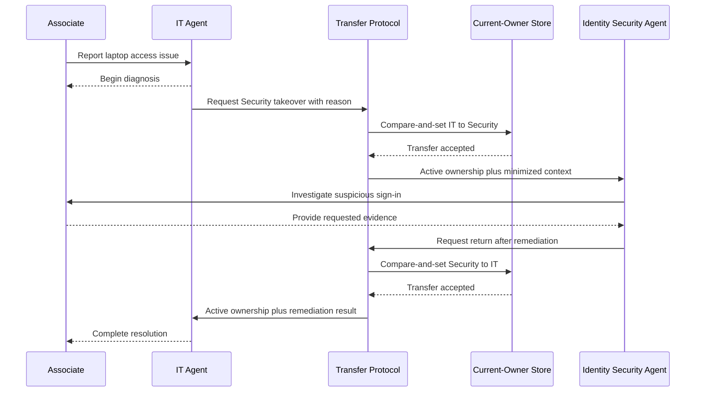

## Logical component architecture


## Control and state model

| Concern                          | Owner                                                       | Scope and boundary                                                                  | Lifetime / durability                                                           |
| -------------------------------- | ----------------------------------------------------------- | ----------------------------------------------------------------------------------- | ------------------------------------------------------------------------------- |
| **Control owner**                | Current active specialist, constrained by transfer protocol | The current owner decides to offer transfer; the target must be eligible and accept | Entire interaction; ownership changes atomically                                |
| **Session context**              | Active agent runtime                                        | Dialogue needed to continue the interaction                                         | Required; interaction lifetime and restorable when needed                       |
| **Agent-private working state**  | Each peer agent                                             | Local reasoning, tools, and sensitive domain context                                | Required; agent/session lifetime                                                |
| **Shared conversation state**    | Conversation or transfer service                            | Only authorized history needed across peers                                         | Conditional; interaction lifetime                                               |
| **Shared working state**         | Transfer envelope / case record                             | Structured diagnosis, transfer reason, and accepted outcome                         | Conditional; case lifetime                                                      |
| **Workflow state / checkpoints** | Transfer runtime                                            | Pending offer, accepted transfer, callback, and resume position                     | Conditional; durable for waits or restart                                       |
| **Task ledger**                  | None                                                        | A handoff chain is not a task plan                                                  | Not typical                                                                     |
| **Long-term memory**             | Separate memory service                                     | Optional preferences; never the current-owner record                                | Optional and cross-session                                                      |
| **Artifacts**                    | Document or object store                                    | Optional diagnostic evidence and remediation records                                | Optional; business retention period                                             |
| **Telemetry**                    | Observability platform                                      | Transfer offers, acceptance, owner changes, hops, and tool effects                  | Operational retention; transfer audit may require business retention separately |

## Capability bill of materials

| Capability                   | Requirement     | Why                                                                          |
| ---------------------------- | --------------- | ---------------------------------------------------------------------------- |
| Session context              | **Required**    | The new owner must continue the interaction coherently                       |
| Agent-private state          | **Required**    | Peers maintain distinct instructions, tools, and data boundaries             |
| Shared conversation          | **Conditional** | Required only when selected history must be visible to the next owner        |
| Shared working state         | **Conditional** | Needed for structured diagnosis, current owner, or durable transfer envelope |
| Durable workflow state       | **Conditional** | Required for asynchronous acceptance, restart, or human takeover             |
| Task ledger                  | **Not typical** | Handoffs do not define an evolving task plan                                 |
| Long-term memory             | **Optional**    | Can personalize service but cannot determine ownership                       |
| Artifact workspace           | **Optional**    | Useful for evidence larger than the transfer contract                        |
| Context transfer             | **Required**    | Carries the minimum authorized state to the next owner                       |
| Capability routing           | **Required**    | Identifies eligible peers for the transfer reason                            |
| Delegation tracking          | **Not typical** | The target becomes owner rather than returning a bounded worker result       |
| Ownership transfer           | **Required**    | Defines the pattern                                                          |
| Concurrent scheduling        | **Not typical** | Exactly one agent owns the active interaction                                |
| Fan-in aggregation           | **Not typical** | Results are not merged from parallel branches                                |
| Turn / speaker management    | **Not typical** | Ownership, not shared-chat speaker selection, controls dialogue              |
| Events / human intervention  | **Conditional** | Needed for asynchronous acceptance or human takeover                         |
| Structured transfer contract | **Conditional** | Required when ownership and context must be validated or audited             |
| Evaluation rubric            | **Not typical** | Quality scoring does not define transfer                                     |
| Conflict resolution          | **Conditional** | Required for competing transfers, rejection, or stale owner updates          |
| Completion policy            | **Required**    | Defines resolved, returned, escalated, abandoned, and failed states          |
| Hard limits                  | **Required**    | Hop, revisit, time, token, and cost bounds prevent transfer loops            |

## Minimum viable implementation

The smallest correct implementation contains:

1. At least two peer specialists
2. One authoritative active-owner value
3. A transfer eligibility policy
4. A minimized context and reason contract
5. Atomic or single-threaded owner change
6. Target acceptance or deterministic transfer semantics
7. Completion plus maximum-hop and revisit rules

It can run synchronously in one process. A parent calling a specialist and automatically receiving control back remains bounded delegation, not Handoff.

## Production additions

* Authorized session-to-user and tenant mapping independent of provider continuation IDs.
* Durable current-owner record with compare-and-set concurrency and transfer audit.
* Versioned peer registry, eligibility, context-minimization, and loop-prevention policies.
* Explicit transfer offer, acceptance, rejection, timeout, return, and human-takeover states.
* Checkpoint recovery at transfer boundaries and idempotent transfer commands.
* Domain-specific redaction and consent before context crosses a boundary.
* Side-effect ownership and compensation policy when control changes mid-action.
* Dead-peer detection, fallback owner, and operational takeover.
* Traces correlating message, owner version, transfer, tools, and business case.

## Low-code realization


| Capability                       | Implementation source                                                             | Maturity / gap                                                                              |
| -------------------------------- | --------------------------------------------------------------------------------- | ------------------------------------------------------------------------------------------- |
| Specialist experiences           | Published Copilot Studio agents **Native**                                        | Stable classic surface                                                                      |
| Connected-agent invocation       | Copilot Studio **Native**                                                         | Commonly bounded parent delegation with a returned result; not decentralized peer ownership |
| Child-agent invocation           | Copilot Studio **Native**                                                         | Shares parent context and owner; not peer handoff                                           |
| Human handoff                    | Copilot Studio **Native**                                                         | Native for supported engagement hubs and channels; this is human, not peer-agent transfer   |
| Peer ownership coordinator       | External API or workflow logic **Custom**                                         | Required for a true decentralized agent chain                                               |
| Current owner and transfer audit | Dataverse **Platform-adjacent**                                                   | GA; use row-version compare-and-set                                                         |
| Transfer context envelope        | Dataverse or secured application API **Platform-adjacent / Custom**               | Application owns minimization, authorization, and version                                   |
| Resume and callbacks             | Power Automate or Logic Apps **Platform-adjacent**                                | Persist owner and pending state before callback                                             |
| Loop, hop, and fallback policy   | Application configuration **Custom**                                              | No first-class peer-handoff policy is supplied                                              |
| Observability                    | Copilot Studio analytics plus Application Insights **Native + Platform-adjacent** | Correlate agent endpoint, owner version, and transfer                                       |

### Low-code boundary

Copilot Studio is a partial fit. Connected-agent calls normally return to the parent and should be classified as Router or Supervisor behavior. A true peer ownership chain requires external channel/endpoint coordination and an authoritative owner record; native human handoff remains a distinct capability.

## Managed pro-code realization


| Capability                        | Implementation source                                                       | Maturity / gap                                                                             |
| --------------------------------- | --------------------------------------------------------------------------- | ------------------------------------------------------------------------------------------ |
| Peer handoff orchestration        | Agent Framework Handoff **Native framework**                                | Stable orchestration pattern; language coverage varies                                     |
| Managed endpoint and scaling      | Foundry Agent Service **Native hosting**                                    | Agent Service GA                                                                           |
| Agent Framework Hosted agent      | Foundry Hosted agents **Native hosting**                                    | Hosted-agent service GA; verify language-specific Agent Framework hosting package maturity |
| Conversation continuity           | Foundry conversation plus Agent Framework sessions **Native**               | Not authoritative owner, authorization, or business state                                  |
| Peer registry and transfer policy | Application configuration **Custom**                                        | Application owns eligibility, redaction, and loop limits                                   |
| Current owner and transfer audit  | Dataverse or Cosmos DB **Platform-adjacent**                                | Conditional for durable, distributed, or audited transfers                                 |
| Standard checkpoints              | Agent Framework **Native framework**                                        | Stable; persist at transfer boundaries with a selected provider                            |
| Human takeover                    | Approval/callback or service-desk integration **Platform-adjacent**         | Persist pending transfer before notification                                               |
| Tools and peer identities         | Foundry Toolbox/MCP plus Entra authorization **Native + Platform-adjacent** | Tool and identity maturity varies                                                          |
| Tracing                           | Foundry tracing plus Application Insights **Native + Platform-adjacent**    | Correlate owner changes and peer tool calls                                                |

### Managed boundary

Agent Framework supplies contextual peer handoff; GA Foundry Hosted agents supply managed hosting. Verify language-specific Agent Framework hosting package maturity. The application still owns transfer authorization, current-owner durability, loop prevention, and audit. Foundry conversations continue messages but are not the owner record.

## Custom code-first realization


| Capability                                     | Implementation source                                                                  | Maturity / gap                                               |
| ---------------------------------------------- | -------------------------------------------------------------------------------------- | ------------------------------------------------------------ |
| Handoff orchestration                          | Agent Framework Handoff **Native framework**                                           | Stable core .NET/Python                                      |
| Runtime and channel adapter                    | Application-selected host plus API **Platform-adjacent + Custom**                      | Application owns message delivery to the current owner       |
| Peer registry, eligibility, and context policy | Application schema and logic **Custom**                                                | Version and authorize per tenant                             |
| Current owner and transfer audit               | Cosmos DB, SQL, or Dataverse **Platform-adjacent**                                     | Use conditional writes and immutable transfer events         |
| Session and checkpoint persistence             | Agent Framework serialization plus selected store **Native + Platform-adjacent**       | Keep provider continuation and business correlation separate |
| Human takeover                                 | Authenticated application API, Teams, or service desk **Platform-adjacent / Custom**   | Verify responder identity and owner version                  |
| Tools                                          | Functions, MCP services, or APIs **Platform-adjacent / Custom**                        | Re-evaluate permissions after transfer                       |
| Reliability                                    | Idempotent transfers, inbox/outbox, and compensation **Custom**                        | Prevent duplicate or split ownership                         |
| API governance                                 | API Management **Platform-adjacent**                                                   | Enforce authentication, throttling, and endpoint policy      |
| Observability                                  | Agent Framework OpenTelemetry plus Application Insights **Native + Platform-adjacent** | Carry interaction, owner version, transfer, and trace IDs    |

## Failure and termination behavior

| Failure or terminal condition              | Required behavior                                                                        |
| ------------------------------------------ | ---------------------------------------------------------------------------------------- |
| Target rejects or cannot accept transfer   | Keep the source as owner or select an approved fallback; record the rejection            |
| Transfer command is duplicated             | Compare transfer ID and expected owner version; return the prior outcome                 |
| Two peers claim ownership                  | Allow one conditional write and reject the stale claimant                                |
| Context is unauthorized or too large       | Block transfer or rebuild a minimized, authorized envelope                               |
| Active owner fails                         | Restore from checkpoint, assign a designated fallback, or escalate to a human            |
| Transfer loops back repeatedly             | Enforce revisit and hop limits, then escalate                                            |
| Side effect is in progress during transfer | Finish, cancel, or explicitly transfer responsibility; never leave ambiguous ownership   |
| Issue is resolved                          | Record terminal owner and outcome and prevent further peer messages except reopen policy |
| Time or cost limit is reached              | Stop transfers and perform transparent human escalation or terminal failure              |

## Architecture cautions

* Initial destination selection without subsequent ownership transfer is Router behavior.
* Parent-supervised connected-agent invocation with a returned result is Supervisor behavior.
* Multiple agents speaking against one common history is Group Chat, not Handoff.
* Do not allow two agents to present themselves as the active owner simultaneously.
* Transfer the minimum necessary context; a full transcript can violate domain boundaries.
* A current-owner record is shared working state, not a task ledger or long-term memory.

## Official references

* [Agent Framework orchestration patterns](https://learn.microsoft.com/en-us/agent-framework/workflows/orchestrations/)
* [Agent Framework agent sessions](https://learn.microsoft.com/en-us/agent-framework/agents/conversations/session)
* [Agent Framework checkpoints](https://learn.microsoft.com/en-us/agent-framework/workflows/checkpoints)
* [Copilot Studio connected agents](https://learn.microsoft.com/en-us/microsoft-copilot-studio/add-agent-copilot-studio-agent)
* [Copilot Studio child agents](https://learn.microsoft.com/en-us/microsoft-copilot-studio/add-agent-child-agent)
* [Copilot Studio transfer to an engagement hub](https://learn.microsoft.com/en-us/microsoft-copilot-studio/advanced-hand-off)
* [Foundry Hosted agents](https://learn.microsoft.com/en-us/azure/foundry/agents/concepts/hosted-agents)
* [Dataverse optimistic concurrency](https://learn.microsoft.com/en-us/power-apps/developer/data-platform/optimistic-concurrency)

***

# Blueprint 7: Group Chat / Shared Conversation

> [Return to pattern selection guidance](agentic-patterns-architecture-position.md#6-pattern-cards)

## Pattern intent

Group Chat lets several participants inspect and respond to a common conversation while an explicit manager or protocol selects speakers, resolves conflict, determines convergence, and terminates the discussion. Shared history alone is insufficient without turn and completion control.

## Professional-services scenario

Policy, employee-relations, accessibility, and associate-advocate agents deliberate over a workplace-accommodation request to identify policy constraints, employee needs, unresolved questions, and an escalation recommendation.

## Interaction sequence

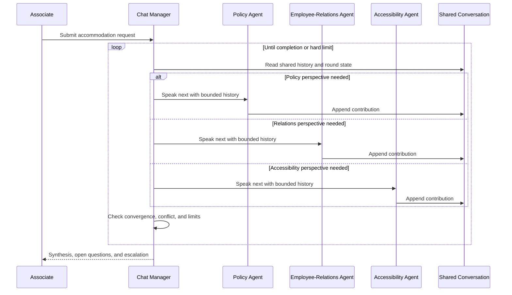

## Logical component architecture


## Control and state model

| Concern                          | Owner                                       | Scope and boundary                                                   | Lifetime / durability                                            |
| -------------------------------- | ------------------------------------------- | -------------------------------------------------------------------- | ---------------------------------------------------------------- |
| **Control owner**                | Chat manager or deterministic turn protocol | Selects speaker, controls visible history, and terminates            | Entire discussion; durable when rounds can wait or restart       |
| **Session context**              | Manager and participant runtimes            | Per-participant model/tool continuation                              | Required; discussion lifetime                                    |
| **Agent-private working state**  | Each participant                            | Role-local reasoning and sensitive context                           | Required; participant/session lifetime                           |
| **Shared conversation state**    | Conversation manager                        | Ordered, append-only contributions visible under policy              | Required; discussion lifetime and optionally retained transcript |
| **Shared working state**         | Structured decision store                   | Questions, claims, disagreements, decisions, and evidence references | Conditional; case lifetime                                       |
| **Workflow state / checkpoints** | Group-chat runtime                          | Current round, eligible speakers, pending request, and stop state    | Conditional; durable for interruption or restart                 |
| **Task ledger**                  | Optional business store                     | Only if the discussion also assigns durable tasks                    | Optional; business retention period                              |
| **Long-term memory**             | Separate memory service                     | Optional participant/user recall; not shared chat or decisions       | Optional and cross-session                                       |
| **Artifacts**                    | Document or object store                    | Evidence and final recommendation versions                           | Conditional; business retention period                           |
| **Telemetry**                    | Observability platform                      | Speaker selection, rounds, token growth, conflict, and cost          | Operational retention                                            |

## Capability bill of materials

| Capability                  | Requirement     | Why                                                                            |
| --------------------------- | --------------- | ------------------------------------------------------------------------------ |
| Session context             | **Required**    | Manager and participants must continue their roles                             |
| Agent-private state         | **Required**    | Participants preserve role-specific reasoning and boundaries                   |
| Shared conversation         | **Required**    | Participants respond to common discussion history                              |
| Shared working state        | **Conditional** | Needed for structured claims, open questions, and decisions                    |
| Durable workflow state      | **Conditional** | Required for long waits, interruption, or restart                              |
| Task ledger                 | **Optional**    | Useful only if deliberation produces assigned work                             |
| Long-term memory            | **Optional**    | Can add cross-session recall but is not the shared thread                      |
| Artifact workspace          | **Conditional** | Required for source evidence or final documents                                |
| Context transfer            | **Required**    | Each speaker receives an authorized view of shared history                     |
| Capability routing          | **Conditional** | Required for dynamic participant eligibility                                   |
| Delegation tracking         | **Optional**    | Useful for requested contributions but not pattern-defining                    |
| Ownership transfer          | **Not typical** | A manager governs turns; peers do not become sole owner                        |
| Concurrent scheduling       | **Conditional** | Independent contributions can be drafted concurrently if merge semantics exist |
| Fan-in aggregation          | **Required**    | A final synthesis or consensus result must be produced                         |
| Turn / speaker management   | **Required**    | Defines who contributes and prevents uncontrolled chatter                      |
| Events / human intervention | **Conditional** | Needed for asynchronous participants or high-risk escalation                   |
| Structured contracts        | **Conditional** | Useful for claims, votes, decisions, and synthesis                             |
| Evaluation rubric           | **Conditional** | Needed when convergence or recommendation quality is scored                    |
| Conflict resolution         | **Required**    | Disagreement is expected and must be surfaced or resolved                      |
| Completion policy           | **Required**    | Defines consensus, sufficient coverage, escalation, or terminal failure        |
| Hard limits                 | **Required**    | Bounds rounds, speakers, tokens, time, and cost                                |

## Minimum viable implementation

The smallest correct implementation contains:

1. At least two distinct participants
2. One ordered shared conversation
3. A manager or deterministic speaker-selection policy
4. Participant-specific private state or role boundaries
5. A conflict policy
6. Final synthesis
7. Completion plus maximum-round rules

It can run synchronously and keep history in memory. Independent generations merged once are Parallel, not Group Chat.

## Production additions

* Authorized participant registry and field-level context filtering.
* Append-only contribution IDs, versions, and optimistic concurrency.
* Context compaction that preserves claims, provenance, unresolved questions, and decisions.
* Durable round/checkpoint state for long-running or human-interrupted discussions.
* Repetition, dominance, collusion, and non-convergence detection.
* Versioned speaker, conflict, consensus, synthesis, and escalation policies.
* Idempotent turns and tool side effects with duplicate-contribution handling.
* Per-discussion budgets for rounds, tokens, elapsed time, and model cost.
* Human review for consequential recommendations and unresolved conflicts.
* Trace every speaker decision, visible-context version, contribution, tool, and synthesis source.

## Low-code realization


| Capability                                  | Implementation source                                                          | Maturity / gap                                                |
| ------------------------------------------- | ------------------------------------------------------------------------------ | ------------------------------------------------------------- |
| Associate experience and participant agents | Copilot Studio **Native**                                                      | Stable classic surface                                        |
| First-class group-chat runtime              | Copilot Studio **Not recommended as native claim**                             | No shared-thread manager with speaker and termination control |
| External chat manager                       | Application service or workflow-composed controller **Custom**                 | Required for true Group Chat                                  |
| Participant invocation                      | Published-agent endpoints, flows, or connectors **Native + Platform-adjacent** | Normally one bounded turn at a time                           |
| Shared conversation                         | Dataverse or application store **Platform-adjacent**                           | Application owns ordering, authorization, and compaction      |
| Structured findings and decisions           | Dataverse **Platform-adjacent**                                                | Keep separate from raw transcript                             |
| Speaker, conflict, and stop policy          | Application configuration **Custom**                                           | Must enforce hard limits                                      |
| Artifacts                                   | SharePoint **Platform-adjacent**                                               | Pin evidence and recommendation versions                      |
| Human escalation                            | Power Automate Approvals **Platform-adjacent**                                 | Persist state before notification                             |
| Observability                               | Analytics plus Application Insights **Native + Platform-adjacent**             | Correlate discussion, round, speaker, and contribution        |

### Low-code boundary

Copilot Studio can host the participant experiences but has no first-class Group Chat runtime. External code or workflow composition must own shared history, speaker selection, conflict resolution, synthesis, and termination. A parent invoking connected agents sequentially without shared peer-visible history remains Supervisor behavior.

## Managed pro-code realization


| Capability                                | Implementation source                                                    | Maturity / gap                                                                             |
| ----------------------------------------- | ------------------------------------------------------------------------ | ------------------------------------------------------------------------------------------ |
| Group-chat orchestration                  | Agent Framework Group Chat **Native framework**                          | Stable orchestration pattern; language coverage varies                                     |
| Managed endpoint and scaling              | Foundry Agent Service **Native hosting**                                 | Agent Service GA                                                                           |
| Agent Framework Hosted agent              | Foundry Hosted agents **Native hosting**                                 | Hosted-agent service GA; verify language-specific Agent Framework hosting package maturity |
| Shared chat and participant sessions      | Agent Framework workflow/session state **Native framework**              | Application controls persistence and context policy                                        |
| Endpoint conversation                     | Foundry conversation state **Native service**                            | Continuation aid only; not a decision store or task ledger                                 |
| Speaker, conflict, and termination policy | Agent Framework manager plus application rules **Native + Custom**       | Custom selection and hard limits remain application-owned                                  |
| Production checkpoint / round store       | Cosmos DB or selected provider **Platform-adjacent / Custom**            | Conditional; standard checkpoints are separate from distributed durability                 |
| Structured decisions                      | Dataverse or Cosmos DB **Platform-adjacent**                             | Preserve claims and decisions outside transcript                                           |
| Artifacts                                 | Blob Storage or SharePoint **Platform-adjacent**                         | Session files are not a shared, multi-writer workspace                                     |
| Tracing                                   | Foundry tracing plus Application Insights **Native + Platform-adjacent** | Monitor token growth and non-convergence                                                   |

### Managed boundary

Agent Framework implements Group Chat and GA Foundry Hosted agents supply managed execution. Verify language-specific Agent Framework hosting package maturity. The application owns participant eligibility, shared-context policy, conflict resolution, and stop conditions. Foundry conversation state and managed memory do not replace structured decisions or durable round state.

## Custom code-first realization


| Capability                                     | Implementation source                                                                    | Maturity / gap                                                   |
| ---------------------------------------------- | ---------------------------------------------------------------------------------------- | ---------------------------------------------------------------- |
| Group-chat manager and participants            | Agent Framework **Native framework**                                                     | Stable core .NET/Python                                          |
| Runtime                                        | Container Apps, AKS, Functions, App Service, or another host **Platform-adjacent**       | Application owns scheduling and scale                            |
| Shared conversation                            | Cosmos DB, SQL, or selected store **Platform-adjacent**                                  | Enforce ordered append and tenant boundary                       |
| Structured decisions and round checkpoints     | Cosmos DB, SQL, or checkpoint provider **Platform-adjacent**                             | Keep transcript, decision state, and checkpoint records distinct |
| Speaker, conflict, compaction, and stop policy | Application schema and logic **Custom**                                                  | Version and evaluate independently                               |
| Tools                                          | Functions, MCP services, or APIs **Platform-adjacent / Custom**                          | Apply participant-specific authorization                         |
| Human escalation                               | Authenticated application API, Teams, or approval service **Platform-adjacent / Custom** | Bind response to discussion and round version                    |
| Artifacts                                      | Blob Storage **Platform-adjacent**                                                       | Pin evidence versions referenced by contributions                |
| Reliability                                    | Idempotent turns and duplicate-contribution handling **Custom**                          | Tool effects may repeat after recovery                           |
| Observability                                  | Agent Framework OpenTelemetry plus Application Insights **Native + Platform-adjacent**   | Trace visible history, speaker choice, turn, and cost            |

## Failure and termination behavior

| Failure or terminal condition                | Required behavior                                                                     |
| -------------------------------------------- | ------------------------------------------------------------------------------------- |
| Selected participant is unavailable          | Select an approved alternative, skip under policy, or escalate                        |
| Contribution is invalid or duplicated        | Reject or deduplicate by discussion, round, speaker, and contribution ID              |
| Two turns append concurrently                | Apply optimistic concurrency and deterministic ordering or merge policy               |
| Discussion repeats or stalls                 | Detect low novelty or unchanged decisions and terminate or escalate                   |
| Participants conflict                        | Preserve positions and provenance; apply resolution, vote, or human escalation policy |
| Shared context exceeds budget                | Compact into structured claims and pinned evidence without silently dropping dissent  |
| Runtime restarts                             | Restore round and shared-history version before selecting the next speaker            |
| Completion criterion is met                  | Freeze the accepted discussion version and synthesize once                            |
| Round, token, time, or cost limit is reached | Stop and return current conclusions, unresolved issues, and escalation                |

## Architecture cautions

* Independent workers that never inspect one another's contributions implement Parallel, not Group Chat.
* A supervisor collecting bounded worker answers without peer-visible history remains Supervisor.
* One active owner at a time is Handoff, not shared conversation.
* More turns do not guarantee better quality; convergence and hard limits are mandatory.
* Do not expose sensitive evidence to every participant merely because the transcript is shared.
* Copilot Studio has no first-class shared-thread speaker and termination manager.

## Official references

* [Agent Framework orchestration patterns](https://learn.microsoft.com/en-us/agent-framework/workflows/orchestrations/)
* [Agent Framework workflow state](https://learn.microsoft.com/en-us/agent-framework/workflows/state)
* [Agent Framework checkpoints](https://learn.microsoft.com/en-us/agent-framework/workflows/checkpoints)
* [Copilot Studio multi-agent considerations](https://learn.microsoft.com/en-us/microsoft-copilot-studio/authoring-add-other-agents)
* [Copilot Studio connected agents](https://learn.microsoft.com/en-us/microsoft-copilot-studio/add-agent-copilot-studio-agent)
* [Foundry runtime components](https://learn.microsoft.com/en-us/azure/foundry/agents/concepts/runtime-components)
* [Foundry Hosted agents](https://learn.microsoft.com/en-us/azure/foundry/agents/concepts/hosted-agents)
* [Dataverse overview](https://learn.microsoft.com/en-us/power-apps/maker/data-platform/data-platform-intro)

***

# Blueprint 8: Evaluator-Optimizer

> [Return to pattern selection guidance](agentic-patterns-architecture-position.md#6-pattern-cards)

## Pattern intent

Evaluator-Optimizer repeatedly produces a versioned candidate, evaluates that exact version against an externalized rubric, returns actionable feedback, and revises until approval, escalation, or a hard limit. Generic quality measurement without a runtime revision path is not this pattern.

## Professional-services scenario

An agent drafts an expense-policy exception request. A policy evaluator checks required evidence, allowable grounds, tone, and routing information. The drafting agent revises until the request is complete or escalates missing evidence to the associate.

## Interaction sequence

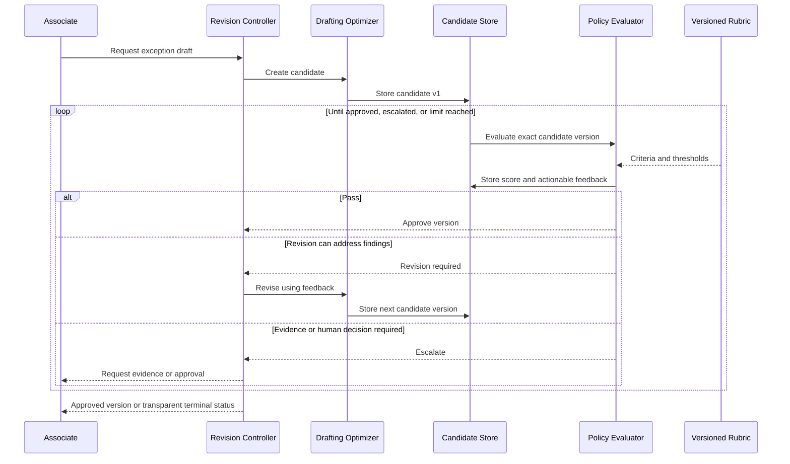

## Logical component architecture


## Control and state model

| Concern                          | Owner                              | Scope and boundary                                                         | Lifetime / durability                             |
| -------------------------------- | ---------------------------------- | -------------------------------------------------------------------------- | ------------------------------------------------- |
| **Control owner**                | Revision loop controller           | Selects generate, evaluate, revise, approve, or escalate                   | Entire quality loop; durable when interrupted     |
| **Session context**              | Front-door or agent runtime        | Associate clarification and final response                                 | Conditional; interaction lifetime                 |
| **Agent-private working state**  | Generator and evaluator separately | Isolates drafting from independent review reasoning                        | Required; iteration lifetime                      |
| **Shared conversation state**    | Optional manager                   | Only if feedback is represented as a common discussion                     | Optional; loop lifetime                           |
| **Shared working state**         | Candidate and feedback store       | Exact candidate version, rubric version, scores, findings, and disposition | Required; loop and audit lifetime                 |
| **Workflow state / checkpoints** | Loop runtime                       | Iteration number, current action, pending human request, and resume point  | Conditional; durable for waits or restart         |
| **Task ledger**                  | None                               | A revision loop is not a decomposed task plan                              | Not typical                                       |
| **Long-term memory**             | Separate memory service            | Optional style or procedural recall; never approval truth                  | Optional and cross-session                        |
| **Artifacts**                    | Document or object store           | Large candidate versions and final approved document                       | Conditional; business retention period            |
| **Telemetry**                    | Observability platform             | Scores, deltas, iterations, latency, usage, and cost                       | Operational retention; not authoritative approval |

## Capability bill of materials

| Capability                  | Requirement     | Why                                                                        |
| --------------------------- | --------------- | -------------------------------------------------------------------------- |
| Session context             | **Conditional** | Needed for associate clarification or interactive delivery                 |
| Agent-private state         | **Required**    | Supports role separation between production and review                     |
| Shared conversation         | **Optional**    | Feedback can be exchanged without a full common transcript                 |
| Shared working state        | **Required**    | Holds candidate, feedback, rubric, and iteration history                   |
| Durable workflow state      | **Conditional** | Required for human waits, long loops, or restart                           |
| Task ledger                 | **Not typical** | The loop revises one candidate rather than managing a task plan            |
| Long-term memory            | **Optional**    | Can recall preferences but cannot hold exact approval state                |
| Artifact workspace          | **Conditional** | Required for large or regulated candidate versions                         |
| Context transfer            | **Required**    | Evaluator sees the exact candidate; optimizer receives actionable feedback |
| Capability routing          | **Not typical** | Producer and evaluator roles are predetermined                             |
| Delegation tracking         | **Conditional** | Needed when evaluation is asynchronous or distributed                      |
| Ownership transfer          | **Not typical** | The loop controller retains control                                        |
| Concurrent scheduling       | **Not typical** | Generate and evaluate are causally ordered                                 |
| Fan-in aggregation          | **Not typical** | A single evaluator loop does not require branch aggregation                |
| Turn / speaker management   | **Conditional** | Required only when implemented through a managed review conversation       |
| Events / human intervention | **Conditional** | Needed for missing evidence or consequential approval                      |
| Structured evaluator output | **Required**    | Pass/fail, scores, findings, and feedback must drive control               |
| Evaluation rubric           | **Required**    | Externalizes quality criteria and thresholds                               |
| Conflict resolution         | **Conditional** | Needed for multiple evaluators or inconsistent criteria                    |
| Completion policy           | **Required**    | Defines approval, non-improvement, escalation, and terminal failure        |
| Hard limits                 | **Required**    | Bounds iterations, tokens, time, cost, and regression                      |

## Minimum viable implementation

The smallest correct implementation contains:

1. A generator and a logically separate evaluator
2. An explicit rubric
3. A versioned candidate
4. Structured pass/fail and actionable feedback
5. A revision edge back to the generator
6. Approval and escalation states
7. A maximum iteration count

It can keep candidates in process memory, but it must evaluate and revise identifiable versions. One critique with no revision path is evaluation, not Evaluator-Optimizer.

## Production additions

* External candidate, feedback, rubric, and approval versions with immutable artifact references.
* Rubric governance, evaluator calibration, regression sets, and independent policy versioning.
* Improvement-delta, oscillation, and regression detection.
* Separate model/provider or deterministic checks where shared blind spots are unacceptable.
* Durable iteration/checkpoint state for human waits and restart.
* Idempotent generator, evaluator, tool, and artifact operations.
* Human approval for consequential decisions and authenticated evidence callbacks.
* Per-loop token, time, cost, and model-call budgets.
* Tracing that correlates candidate, rubric, evaluator result, revision, and final disposition.

## Low-code realization


| Capability                    | Implementation source                                                                 | Maturity / gap                                                |
| ----------------------------- | ------------------------------------------------------------------------------------- | ------------------------------------------------------------- |
| Associate experience          | Copilot Studio agent **Native**                                                       | Stable classic surface                                        |
| Generator and evaluator roles | Copilot Studio agents, topics, or prompts **Native**                                  | Stable surfaces; role independence is design-owned            |
| Runtime revision controller   | Agent flow or Power Automate composition **Custom configuration / Platform-adjacent** | No dedicated first-class evaluator-loop primitive             |
| Rubric and thresholds         | Dataverse/configuration plus flow logic **Custom / Platform-adjacent**                | Version and approve outside prompt text                       |
| Candidate and feedback state  | Dataverse **Platform-adjacent**                                                       | GA; store exact version and status                            |
| Artifact versions             | SharePoint **Platform-adjacent**                                                      | Pin candidate version or content hash                         |
| Human approval                | Power Automate Approvals **Platform-adjacent**                                        | Persist request before notification; duration limits apply    |
| Completion and hard limits    | Flow conditions and counters **Custom configuration**                                 | Must be deterministic                                         |
| Long-running recovery         | Ledger-driven independent flows **Platform-adjacent**                                 | Waiting flow state is not an arbitrary agent-graph checkpoint |
| Observability                 | Analytics plus Application Insights **Native + Platform-adjacent**                    | Correlate iteration, candidate, rubric, and score             |

### Low-code boundary

Copilot Studio supplies agent roles and deterministic automation, but the maker composes the rubric loop and owns candidate versions, feedback, counters, stop conditions, and recovery. Foundry-style evaluation measurement is not supplied by Copilot Studio and would still not create a revision loop by itself.

## Managed pro-code realization


| Capability                          | Implementation source                                                        | Maturity / gap                                                                                          |
| ----------------------------------- | ---------------------------------------------------------------------------- | ------------------------------------------------------------------------------------------------------- |
| Revision loop                       | Agent Framework graph, executors, and conditional edges **Native framework** | Stable primitives; Evaluator-Optimizer is a composition, not necessarily a named packaged orchestration |
| Managed endpoint and scaling        | Foundry Agent Service **Native hosting**                                     | Agent Service GA                                                                                        |
| Agent Framework Hosted agent        | Foundry Hosted agents **Native hosting**                                     | Hosted-agent service GA; verify language-specific Agent Framework hosting package maturity              |
| Generator and evaluator sessions    | Agent Framework **Native framework**                                         | Keep role-private context separate                                                                      |
| Candidate and feedback store        | Dataverse or Cosmos DB **Platform-adjacent**                                 | Required for durable/auditable versions                                                                 |
| Standard checkpoints                | Agent Framework **Native framework**                                         | Stable; production provider remains explicit                                                            |
| Foundry evaluations                 | Foundry evaluation capabilities **Native service**                           | Quality measurement with mixed evaluator maturity; does not automatically drive runtime revision        |
| Artifacts                           | Blob Storage or SharePoint **Platform-adjacent**                             | Session files do not replace versioned approval artifacts                                               |
| Rubric, thresholds, and hard limits | Application policy **Custom**                                                | Version independently from prompts and models                                                           |
| Tracing                             | Foundry tracing plus Application Insights **Native + Platform-adjacent**     | Record iteration, version, score, and cost                                                              |

### Managed boundary

Agent Framework implements the generate/evaluate/revise graph; GA Foundry Hosted agents supply managed execution. Verify language-specific Agent Framework hosting package maturity. Foundry evaluations can measure quality but do not supply the runtime revision loop, candidate store, rubric governance, or terminal policy.

## Custom code-first realization


| Capability                              | Implementation source                                                                    | Maturity / gap                                         |
| --------------------------------------- | ---------------------------------------------------------------------------------------- | ------------------------------------------------------ |
| Revision graph and role agents          | Agent Framework **Native framework**                                                     | Stable .NET/Python core                                |
| Runtime                                 | Container Apps, AKS, Functions, App Service, or another host **Platform-adjacent**       | Application owns scaling and lifecycle                 |
| Candidate, feedback, and approval state | Cosmos DB, SQL, or Dataverse **Platform-adjacent**                                       | Use optimistic concurrency and exact version IDs       |
| Rubric, thresholds, and termination     | Application schema and logic **Custom**                                                  | Treat as governed policy                               |
| Checkpoint persistence                  | Agent Framework checkpoints plus selected store **Native + Platform-adjacent**           | Conditional; separate from candidate truth             |
| Evidence tools                          | Functions, MCP services, or APIs **Platform-adjacent / Custom**                          | Pin evidence versions and authorize per role           |
| Artifacts                               | Blob Storage **Platform-adjacent**                                                       | Use immutable candidate and approved versions          |
| Human approval                          | Authenticated application API, Teams, or approval service **Platform-adjacent / Custom** | Bind decision to candidate and rubric versions         |
| Reliability                             | Idempotency, duplicate-result lookup, and compensation **Custom**                        | Avoid duplicate drafts, notifications, or side effects |
| Observability                           | Agent Framework OpenTelemetry plus Application Insights **Native + Platform-adjacent**   | Correlate candidate lineage and quality delta          |

## Failure and termination behavior

| Failure or terminal condition                    | Required behavior                                                     |
| ------------------------------------------------ | --------------------------------------------------------------------- |
| Evaluator output is invalid                      | Reject it and retry within a bounded evaluator policy                 |
| Evaluator and rubric versions do not match       | Stop and reevaluate the candidate against the intended rubric         |
| Candidate regresses or oscillates                | Restore the best accepted version, stop, or escalate                  |
| Feedback is not actionable                       | Request structured findings once or terminate as evaluator failure    |
| Evidence is missing                              | Persist the pending request and ask the associate or a human          |
| Generator or evaluator is duplicated             | Deduplicate by candidate, rubric, role, and attempt                   |
| Approval threshold is met                        | Freeze exact candidate and rubric versions and mark terminal approval |
| Iteration, time, token, or cost limit is reached | Stop with best candidate, remaining findings, and escalation status   |
| Runtime restarts                                 | Restore iteration state and resume from the exact candidate version   |

## Architecture cautions

* Offline or release evaluation without runtime revision is measurement, not Evaluator-Optimizer.
* Open multi-party deliberation is Group Chat; this pattern has asymmetric producer and evaluator roles.
* Do not let the evaluator silently rewrite the candidate unless the architecture explicitly combines roles.
* A mutable document without candidate IDs or versions makes feedback and approval ambiguous.
* Long-term memory is not candidate, rubric, feedback, or approval state.
* Agent Framework supplies the graph primitives; do not overstate a generic packaged Evaluator-Optimizer orchestration.

## Official references

* [Agent Framework workflow edges](https://learn.microsoft.com/en-us/agent-framework/workflows/edges)
* [Agent Framework workflow state](https://learn.microsoft.com/en-us/agent-framework/workflows/state)
* [Agent Framework checkpoints](https://learn.microsoft.com/en-us/agent-framework/workflows/checkpoints)
* [Copilot Studio agent flows](https://learn.microsoft.com/en-us/microsoft-copilot-studio/flows-overview)
* [Power Automate limits](https://learn.microsoft.com/en-us/power-automate/limits-and-config)
* [Run evaluations from the Foundry portal](https://learn.microsoft.com/en-us/azure/foundry/how-to/evaluate-generative-ai-app)
* [Foundry agent tracing](https://learn.microsoft.com/en-us/azure/foundry/observability/concepts/trace-agent-concept)
* [Foundry Hosted agents](https://learn.microsoft.com/en-us/azure/foundry/agents/concepts/hosted-agents)

***

# Blueprint 9: Conditional Graph / State Machine

> [Return to pattern selection guidance](agentic-patterns-architecture-position.md#6-pattern-cards)

## Pattern intent

A Conditional Graph / State Machine advances work through explicit lifecycle states and permitted transitions. Guards, terminal states, interrupts, and recoverable execution position—not merely an if/else prompt or a revision loop—define the pattern.

## Professional-services scenario

An equipment-purchase request moves through eligibility, budget, information-security, accessibility, manager approval, procurement, fulfillment, and exception states. Agents interpret requests and evidence, while the state machine controls advancement.

## Interaction sequence

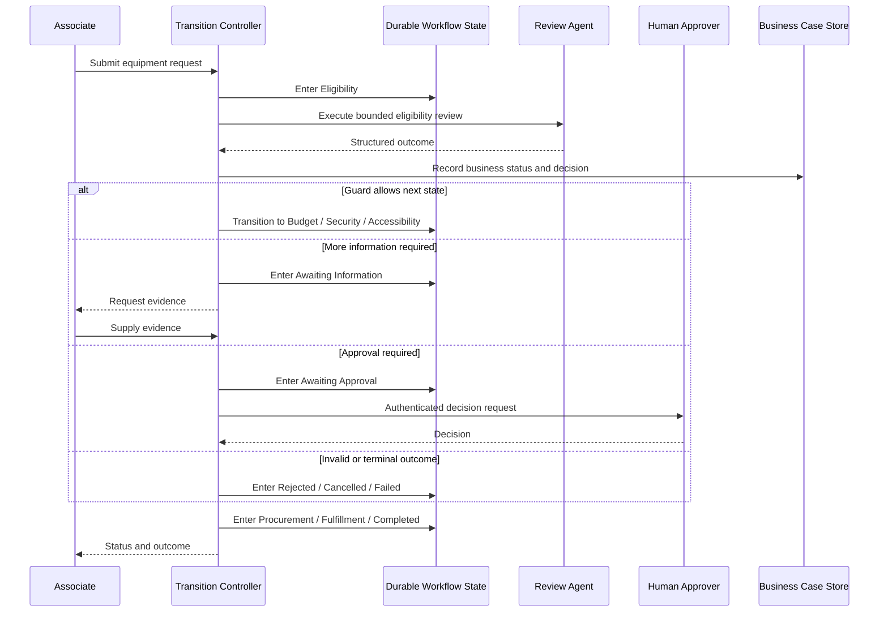

### Lifecycle view

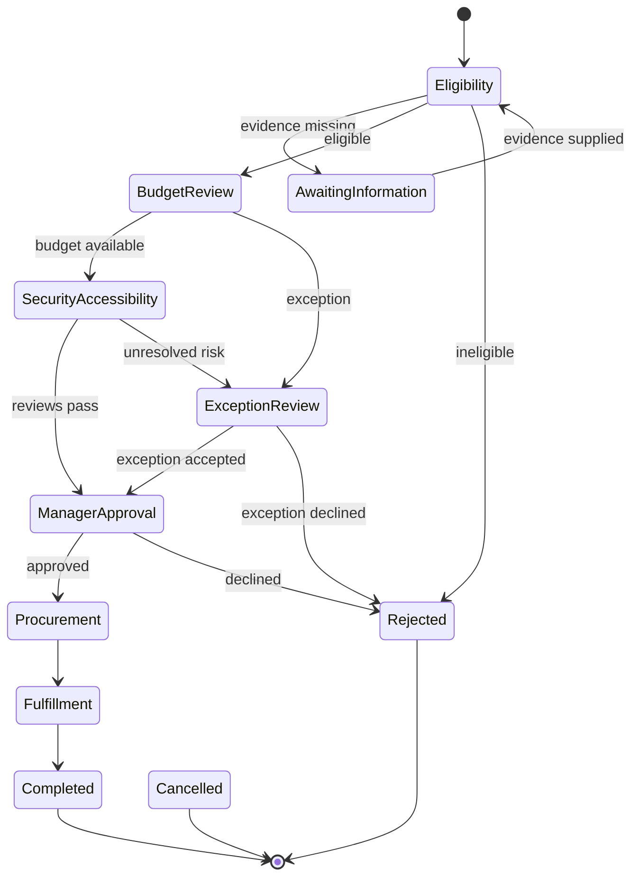

## Logical component architecture


## Control and state model

| Concern                          | Owner                                    | Scope and boundary                                                            | Lifetime / durability                                    |
| -------------------------------- | ---------------------------------------- | ----------------------------------------------------------------------------- | -------------------------------------------------------- |
| **Control owner**                | Transition controller                    | Evaluates guards and permits only versioned transitions                       | Entire process; must recover when durability is required |
| **Session context**              | Front-door agent/runtime                 | Associate messages used by a current state action                             | Conditional; interaction lifetime                        |
| **Agent-private working state**  | State executor or review agent           | Intermediate reasoning for one state action                                   | Conditional; state-action lifetime                       |
| **Shared conversation state**    | Optional conversation manager            | Used only for interactive clarification                                       | Optional; interaction lifetime                           |
| **Shared working state**         | Business case store                      | Structured facts, decisions, current business status, and evidence references | Required; process/business retention period              |
| **Workflow state / checkpoints** | Workflow runtime and checkpoint provider | Execution position, pending messages, timers, requests, and executor state    | Required; durable and restorable                         |
| **Task ledger**                  | Business store                           | Conditional work items, approvals, ownership, and attempts                    | Conditional; business retention period                   |
| **Long-term memory**             | Separate memory service                  | Optional preferences or procedural recall                                     | Optional; never transition or authorization truth        |
| **Artifacts**                    | Document or object store                 | Evidence, approvals, purchase documents, and versions                         | Conditional; business retention period                   |
| **Telemetry**                    | Observability platform                   | Transition, guard, executor, retry, wait, and cost traces                     | Operational retention; not canonical process audit       |

## Capability bill of materials

| Capability                      | Requirement     | Why                                                            |
| ------------------------------- | --------------- | -------------------------------------------------------------- |
| Session context                 | **Conditional** | Needed for conversational state actions                        |
| Agent-private state             | **Conditional** | Needed when agents reason within a state                       |
| Shared conversation             | **Optional**    | Clarification can occur without defining the lifecycle         |
| Shared working state            | **Required**    | Carries structured case facts and transition inputs            |
| Durable workflow state          | **Required**    | Preserves explicit execution position, waits, and timers       |
| Task ledger                     | **Conditional** | Required when states create durable owned business work        |
| Long-term memory                | **Optional**    | Can aid personalization but cannot drive exact transitions     |
| Artifact workspace              | **Conditional** | Required for evidence and generated documents                  |
| Context transfer                | **Required**    | State actions need bounded current-state inputs                |
| Capability routing              | **Required**    | Maps states and outcomes to valid executors and transitions    |
| Delegation tracking             | **Conditional** | Required for asynchronous state actions                        |
| Ownership transfer              | **Conditional** | Required when a state assigns the active case owner            |
| Concurrent scheduling           | **Conditional** | Required for explicit parallel substates                       |
| Fan-in aggregation              | **Conditional** | Required when parallel substates join                          |
| Turn / speaker management       | **Not typical** | Lifecycle control does not require shared deliberation         |
| Events / human intervention     | **Conditional** | Required for callbacks, timers, approvals, or external changes |
| Structured state-action outputs | **Required**    | Guards need constrained outcomes                               |
| Evaluation rubric               | **Conditional** | Required when a review state applies quality criteria          |
| Conflict resolution             | **Conditional** | Required for competing events or parallel-state outcomes       |
| Completion policy               | **Required**    | Defines valid terminal states and terminal failure             |
| Hard limits                     | **Conditional** | Bounds retries, loops, waits, concurrency, tokens, and cost    |

## Minimum viable implementation

The smallest correct implementation contains:

1. An explicit state schema with an initial state
2. At least one conditional transition
3. Versioned guards or transition rules
4. A structured state-action result
5. One or more valid terminal states
6. Invalid-transition handling
7. Persisted current state when recovery is part of the requirement

A short in-process graph can use in-memory execution state, but it must not claim restart durability. A fixed linear path with no meaningful lifecycle semantics is Sequential.

## Production additions

* Separate workflow execution state, runtime checkpoints, and authoritative business case/task state.
* Persist transition intent before side effects and record outcome before advancing.
* Use optimistic concurrency for external events and human decisions.
* Apply idempotency, inbox/outbox, retries, timeouts, DLQ, and compensation.
* Persist authenticated approval and callback correlation before notification.
* Version states, guards, schemas, executors, policies, and migration rules.
* Define cancellation, supersession, reopen, invalid-event, and poison-state behavior.
* Pin evidence and artifact versions used by each decision.
* Trace business process, execution instance, state, transition, event, tool, and cost IDs.
* Add operational intervention for stuck timers, failed compensation, and manual state repair.

## Low-code realization


| Capability                                       | Implementation source                                                | Maturity / gap                                                                       |
| ------------------------------------------------ | -------------------------------------------------------------------- | ------------------------------------------------------------------------------------ |
| Explicit conversational graph                    | Classic topics and conditions **Native**                             | Stable; scoped to the classic authoring experience                                   |
| Deterministic state actions                      | Agent flows **Native automation surface**                            | Stable; not an arbitrary agent-workflow checkpoint runtime                           |
| New workflows option                             | Copilot Studio workflows **Native**                                  | Public preview; separate artifact format                                             |
| Business state and transition audit              | Dataverse **Platform-adjacent**                                      | GA; preferred low-code source of case truth                                          |
| Long-running deterministic process               | Power Automate or Logic Apps **Platform-adjacent**                   | Stable; design around duration and callback limits                                   |
| State/guard schema and invalid-transition policy | Application configuration and Dataverse schema **Custom**            | Maker owns versioning and migration                                                  |
| Human approvals                                  | Power Automate Approvals **Platform-adjacent**                       | Persist state before notification; run duration limits apply                         |
| Evidence and artifacts                           | SharePoint **Platform-adjacent**                                     | Store immutable version references in the case record                                |
| Recovery                                         | Idempotent, Dataverse-triggered flows **Platform-adjacent + Custom** | Reconstruct from business state; waiting flow state is not an agent-graph checkpoint |
| Observability                                    | Analytics plus Application Insights **Native + Platform-adjacent**   | Correlate case, flow run, state, transition, and callback                            |

### Low-code boundary

Copilot Studio classic topics and agent flows can natively express explicit branches and loops; the new workflows surface remains preview. Dataverse should own authoritative case state for long-lived processes. Use external deterministic workflow orchestration where process durability exceeds an agent turn, and do not call waiting flow state an arbitrary Agent Framework checkpoint.

## Managed pro-code realization


| Capability                        | Implementation source                                                              | Maturity / gap                                                                             |
| --------------------------------- | ---------------------------------------------------------------------------------- | ------------------------------------------------------------------------------------------ |
| Graph and transition execution    | Agent Framework workflow primitives **Native framework**                           | Stable .NET/Python; generic State Machine is a composition over graph primitives           |
| Standard checkpoints              | Agent Framework **Native framework**                                               | Stable; captures runtime state and is separate from distributed durable execution          |
| Managed endpoint and scaling      | Foundry Agent Service **Native hosting**                                           | Agent Service GA                                                                           |
| Agent Framework Hosted agent      | Foundry Hosted agents **Native hosting**                                           | Hosted-agent service GA; verify language-specific Agent Framework hosting package maturity |
| Production checkpoint store       | Cosmos DB or application-selected provider **Platform-adjacent / Custom**          | Provider coverage varies by language                                                       |
| Business case/task state          | Dataverse, Cosmos DB, or SQL **Platform-adjacent**                                 | Separate from conversation and checkpoint state                                            |
| Distributed durable execution     | Durable Functions or Durable Task **Platform-adjacent**                            | Stable alternatives; separate from Foundry hosting                                         |
| Agent Framework Durable Extension | Agent Framework integration plus Durable Task infrastructure **Platform-adjacent** | Preview/prerelease; not automatically part of Hosted-agent execution                       |
| Human callbacks and artifacts     | Approval service plus Blob/SharePoint **Platform-adjacent**                        | Persist request and exact evidence versions                                                |
| Tracing                           | Foundry tracing plus Application Insights **Native + Platform-adjacent**           | Correlate state, transition, executor, and external event                                  |

### Managed boundary

Agent Framework implements the graph and standard checkpoints; GA Foundry Hosted agents supply managed execution. Verify language-specific Agent Framework hosting package maturity. The business case remains external. If distributed durable execution is required, add Durable Functions/Durable Task or explicitly accept the preview Durable Extension as a separate adjacent capability.

## Custom code-first realization


| Capability                                       | Implementation source                                                                    | Maturity / gap                                                 |
| ------------------------------------------------ | ---------------------------------------------------------------------------------------- | -------------------------------------------------------------- |
| Graph, state executors, and standard checkpoints | Agent Framework **Native framework**                                                     | Stable .NET/Python core                                        |
| Runtime                                          | Container Apps, AKS, Functions, App Service, or another host **Platform-adjacent**       | Application owns process lifecycle                             |
| Durable orchestration                            | Durable Task Scheduler or Durable Functions **Platform-adjacent**                        | GA for supported SDKs; execution history is not business truth |
| Agent Framework Durable Extension                | Agent Framework integration plus Durable Task **Platform-adjacent**                      | Preview/prerelease; optional                                   |
| Business case and task state                     | Cosmos DB, SQL, or Dataverse **Platform-adjacent**                                       | Select transaction and partition boundaries deliberately       |
| State/guard schema and migration                 | Application logic **Custom**                                                             | Version transitions and in-flight migration                    |
| Commands and events                              | Service Bus and Event Grid **Platform-adjacent**                                         | Commands assign work; events announce changes                  |
| Human callbacks                                  | Authenticated application API, Teams, or approval service **Platform-adjacent / Custom** | Apply expected-state concurrency                               |
| Reliability and compensation                     | Inbox/outbox, idempotency, retry, and saga policy **Custom**                             | Exactly-once side effects are not automatic                    |
| Observability                                    | Agent Framework OpenTelemetry plus Application Insights **Native + Platform-adjacent**   | Carry process, execution, transition, message, and trace IDs   |

## Failure and termination behavior

| Failure or terminal condition                        | Required behavior                                                                                           |
| ---------------------------------------------------- | ----------------------------------------------------------------------------------------------------------- |
| Invalid transition is requested                      | Reject it without changing business or workflow state; record reason and policy version                     |
| State action returns invalid output                  | Keep current state, record failure, and apply bounded retry or escalation                                   |
| Duplicate or stale event arrives                     | Compare event/command ID and expected state version; ignore or reject safely                                |
| Human response arrives after timeout or supersession | Reject against current state/version and preserve the late response for audit                               |
| Side effect succeeds but state write fails           | Reconcile by idempotency key or execute persisted compensation                                              |
| Runtime restarts                                     | Restore checkpoint or reconstruct from authoritative state without replaying non-idempotent effects blindly |
| No valid outgoing transition exists                  | Enter an explicit failed/manual-review state rather than stall silently                                     |
| Completed, rejected, or cancelled state is reached   | Enforce terminal behavior and documented reopen policy                                                      |
| Retry, loop, time, or cost limit is reached          | Transition to explicit failure or escalation state                                                          |

## Architecture cautions

* A fixed ordered path with secondary branching is often Sequential, not primarily a State Machine.
* An evaluator loop is not a lifecycle model unless explicit states and transitions are central.
* Workflow history and checkpoints are runtime recovery evidence, not the authoritative business case or task ledger.
* Foundry conversations, session files, and memory cannot hold exact transition truth.
* Agent Framework standard checkpoints are distinct from the preview/prerelease Durable Extension.
* Do not build new dependencies on the retiring Foundry visual workflow designer.

## Official references

* [Agent Framework workflow edges](https://learn.microsoft.com/en-us/agent-framework/workflows/edges)
* [Agent Framework workflow state](https://learn.microsoft.com/en-us/agent-framework/workflows/state)
* [Agent Framework checkpoints](https://learn.microsoft.com/en-us/agent-framework/workflows/checkpoints)
* [Agent Framework human in the loop](https://learn.microsoft.com/en-us/agent-framework/workflows/human-in-the-loop)
* [Agent Framework Durable Extension](https://learn.microsoft.com/en-us/agent-framework/integrations/durable-extension)
* [Copilot Studio agent flows](https://learn.microsoft.com/en-us/microsoft-copilot-studio/flows-overview)
* [Copilot Studio new workflows](https://learn.microsoft.com/en-us/microsoft-copilot-studio/workflows-experience/flows-overview)
* [Durable Task hosting guidance](https://learn.microsoft.com/en-us/azure/durable-task/common/choose-orchestration-framework)
* [Foundry Hosted agents](https://learn.microsoft.com/en-us/azure/foundry/agents/concepts/hosted-agents)

***

# Blueprint 10: Blackboard / Shared Workspace

> [Return to pattern selection guidance](agentic-patterns-architecture-position.md#6-pattern-cards)

## Pattern intent

Blackboard agents coordinate indirectly by claiming work and reading or updating durable structured shared state and versioned artifacts. Multi-writer concurrency, notification, conflict resolution, and completion policy—not a common chat transcript—define the pattern.

## Professional-services scenario

A workplace case workspace holds the associate's request, evidence checklist, policy excerpts, assigned specialists, pending approvals, generated documents, and decision history. HR, IT, travel, and procurement agents contribute asynchronously without sharing a full chat transcript.

## Interaction sequence

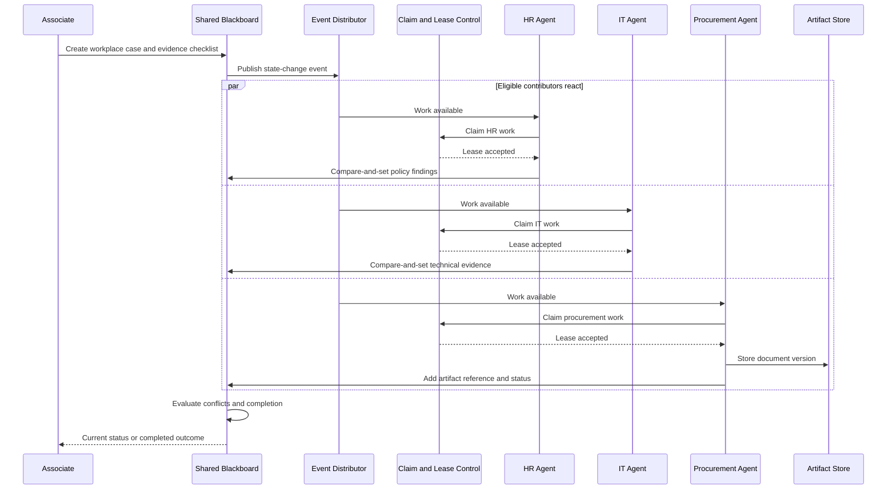

## Logical component architecture

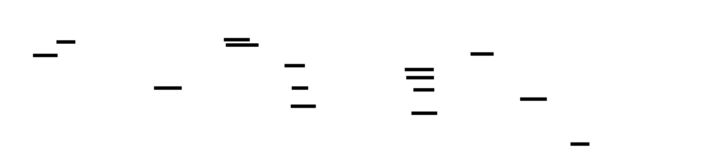

## Control and state model

| Concern                          | Owner                                                         | Scope and boundary                                                                | Lifetime / durability                                           |
| -------------------------------- | ------------------------------------------------------------- | --------------------------------------------------------------------------------- | --------------------------------------------------------------- |
| **Control owner**                | Distributed claim/concurrency protocol plus completion policy | No conversational supervisor owns every action; workers coordinate through state  | Case lifetime; durable                                          |
| **Session context**              | Individual worker runtime                                     | One contribution attempt and its tools                                            | Conditional; invocation lifetime                                |
| **Agent-private working state**  | Each contributor                                              | Intermediate reasoning before publishing                                          | Required; contribution lifetime                                 |
| **Shared conversation state**    | None                                                          | Coordination occurs through structured state, not common chat                     | Not typical                                                     |
| **Shared working state**         | Blackboard operational store                                  | Facts, assignments, decisions, progress, versions, and references                 | Required; authoritative for shared coordination                 |
| **Workflow state / checkpoints** | Individual worker/workflow runtime                            | Local attempts, pending tool calls, and recoverable execution                     | Conditional; durable per worker when needed                     |
| **Task ledger**                  | Task/claim store                                              | Work identity, dependency, owner/lease, status, attempts, approvals, and outcomes | Conditional but normally expected for complex asynchronous work |
| **Long-term memory**             | Separate memory service                                       | Optional cross-session recall; never blackboard truth                             | Optional                                                        |
| **Artifacts**                    | Document or object store                                      | Evidence, generated documents, and immutable versions                             | Required; business retention period                             |
| **Telemetry**                    | Observability platform                                        | Claims, versions, contributions, conflicts, events, tools, and cost               | Operational retention; not the decision history                 |

## Capability bill of materials

| Capability                        | Requirement     | Why                                                                             |
| --------------------------------- | --------------- | ------------------------------------------------------------------------------- |
| Session context                   | **Conditional** | Needed only for interactive or multi-turn contributors                          |
| Agent-private state               | **Required**    | Contributors reason independently before publishing                             |
| Shared conversation               | **Not typical** | Structured workspace replaces a common transcript                               |
| Shared working state              | **Required**    | Defines the coordination substrate                                              |
| Durable workflow state            | **Conditional** | Required for long-running worker attempts or restart                            |
| Task ledger                       | **Conditional** | Required when work must be claimed, owned, retried, or approved                 |
| Long-term memory                  | **Optional**    | Can aid recall but cannot hold workspace truth                                  |
| Artifact workspace                | **Required**    | Durable versioned evidence and outputs define the pattern's workspace           |
| Context transfer                  | **Required**    | Workers receive a consistent state and artifact snapshot                        |
| Capability routing                | **Conditional** | Needed to notify or match eligible contributors                                 |
| Delegation tracking               | **Conditional** | Needed for explicit tasks and claims                                            |
| Ownership transfer                | **Conditional** | Required when claims or leases can be reassigned                                |
| Concurrent scheduling             | **Required**    | Multiple independent contributors can act on shared work                        |
| Fan-in aggregation                | **Conditional** | Required when several contributions form one decision or artifact               |
| Turn / speaker management         | **Not typical** | There is no shared speaker sequence                                             |
| Events / human intervention       | **Required**    | Contributors must discover new work and humans must be able to review or decide |
| Structured contribution contracts | **Required**    | Enables validation, versioning, and deterministic conflict detection            |
| Evaluation rubric                 | **Conditional** | Needed to judge evidence or aggregate contributions                             |
| Conflict resolution               | **Required**    | Multi-writer updates and contradictory findings are intrinsic risks             |
| Completion policy                 | **Required**    | Determines when case, task set, or artifact is complete                         |
| Hard limits                       | **Conditional** | Bounds claims, retries, stale work, concurrency, tokens, time, and cost         |

## Minimum viable implementation

The smallest correct implementation contains:

1. A durable structured shared workspace
2. A separate versioned artifact store or artifact-version capability
3. At least two contributors with private working context
4. Work-discovery through polling or events
5. A claim or optimistic-concurrency rule
6. Structured contribution contracts
7. Conflict and completion policy

It can use a single transactional database plus object/document storage. A shared transcript alone is Group Chat, not a blackboard.

## Production additions

* Canonical task, claim, lease, heartbeat, attempt, approval, and failure schema.
* ETag/row-version conditional writes, idempotency keys, and duplicate-contribution lookup.
* Inbox/outbox between state changes and commands/events.
* Service Bus commands for owned work; Event Grid or change feed for state-change notification.
* Lease expiry, stale-work detection, requeue, dead-letter, and manual takeover.
* Immutable artifact versions, content hashes, retention, and malware/content controls.
* Tenant partitioning, field-level authorization, contributor identity, and provenance.
* Conflict classes, merge/review policy, and protected final-decision fields.
* Per-tenant concurrency, cost, and storage quotas.
* Traces connecting case, task, claim, event, worker, artifact version, decision, and cost.

## Low-code realization


| Capability                               | Implementation source                                                              | Maturity / gap                                                      |
| ---------------------------------------- | ---------------------------------------------------------------------------------- | ------------------------------------------------------------------- |
| Associate and specialist agents          | Copilot Studio **Native**                                                          | Stable classic surface                                              |
| Shared structured workspace              | Dataverse **Platform-adjacent**                                                    | GA; preferred low-code operational state                            |
| Task, claim, owner, and approval records | Dataverse **Platform-adjacent**                                                    | GA; maker owns schema, leases, and concurrency                      |
| Versioned artifacts                      | SharePoint **Platform-adjacent**                                                   | Stable; keep references and versions in Dataverse                   |
| Work discovery                           | Power Automate Dataverse/SharePoint triggers **Platform-adjacent**                 | Stable; events can duplicate and must be idempotent                 |
| Worker invocation                        | Agent flows and Run an agent node **Native**                                       | Bounded calls; do not hold a single call open for long-running work |
| Claim, lease, and conflict policy        | Flow expressions, plug-ins, or custom connector/API **Custom / Platform-adjacent** | Application owns atomicity and stale-work behavior                  |
| Human review                             | Power Automate Approvals or Teams integration **Platform-adjacent**                | Persist approval and expected version first                         |
| Long-term memory                         | Copilot Studio memory **Native**                                                   | Preview; never workspace or ledger state                            |
| Observability                            | Analytics plus Application Insights **Native + Platform-adjacent**                 | Propagate case, task, claim, and artifact IDs                       |

### Low-code boundary

Copilot Studio supplies contributors and deterministic actions; Dataverse and SharePoint supply the defining shared state and artifacts. The application must implement claims, optimistic concurrency, stale-work handling, conflict resolution, and completion. Conversation context and preview memory remain separate concerns.

## Managed pro-code realization


| Capability                             | Implementation source                                                    | Maturity / gap                                                                                |
| -------------------------------------- | ------------------------------------------------------------------------ | --------------------------------------------------------------------------------------------- |
| Specialist contributors                | Agent Framework workers **Native framework**                             | Stable core .NET/Python                                                                       |
| Managed worker hosting                 | Foundry Hosted agents **Native hosting**                                 | GA; verify language-specific Agent Framework hosting package maturity                         |
| Request conversation                   | Foundry conversation state **Native service**                            | Not the blackboard, task ledger, or artifact system                                           |
| Shared working state                   | Dataverse or Cosmos DB **Platform-adjacent**                             | Required external authoritative store                                                         |
| Tasks, claims, leases, and approvals   | Dataverse, Cosmos DB, or SQL **Platform-adjacent**                       | Application-owned schema and transaction policy                                               |
| Versioned artifacts                    | Blob Storage or SharePoint **Platform-adjacent**                         | Hosted session files are preview, session-scoped, and not a multi-writer workspace            |
| Work commands                          | Service Bus **Platform-adjacent**                                        | At-least-once; use idempotent handlers, DLQ, and bounded concurrency                          |
| State-change events                    | Event Grid or Cosmos DB change feed **Platform-adjacent**                | Notification only; not an ownership command                                                   |
| Claim, conflict, and completion policy | Application logic **Custom**                                             | Agent Framework Blackboard is a composition over primitives, not a universal packaged runtime |
| Tracing                                | Foundry tracing plus Application Insights **Native + Platform-adjacent** | Correlate contributions with exact state/artifact versions                                    |

### Managed boundary

Agent Framework supplies the worker logic and GA Foundry Hosted agents supply managed execution. Verify language-specific Agent Framework hosting package maturity. The defining blackboard, task/claim records, and artifacts remain external. Foundry conversation state, managed memory, and session files cannot be used as transactional multi-writer coordination.

## Custom code-first realization


| Capability                            | Implementation source                                                                    | Maturity / gap                                           |
| ------------------------------------- | ---------------------------------------------------------------------------------------- | -------------------------------------------------------- |
| Worker agents and workflow primitives | Agent Framework **Native framework**                                                     | Stable .NET/Python core                                  |
| Runtime                               | Container Apps, AKS, Functions, App Service, or another host **Platform-adjacent**       | Application owns worker lifecycle and scale              |
| Shared working state and task ledger  | Cosmos DB, SQL, or Dataverse **Platform-adjacent**                                       | Choose partition and transaction boundaries deliberately |
| Claims, leases, and conflict policy   | Conditional writes plus application logic **Custom**                                     | No universal blackboard coordinator is supplied          |
| Versioned artifacts                   | Blob Storage **Platform-adjacent**                                                       | Use versions, hashes, ETags, and immutable references    |
| Work distribution                     | Service Bus **Platform-adjacent**                                                        | Commands assign work; handlers must be idempotent        |
| State-change notification             | Event Grid or database change feed **Platform-adjacent**                                 | Events can duplicate and are not task ownership          |
| Human callbacks                       | Authenticated application API, Teams, or approval service **Platform-adjacent / Custom** | Apply expected-version concurrency                       |
| Reliability                           | Inbox/outbox, deduplication, compensation, and stale-work policy **Custom**              | Protect state/message boundaries explicitly              |
| Observability                         | Agent Framework OpenTelemetry plus Application Insights **Native + Platform-adjacent**   | Carry case, task, claim, version, event, and trace IDs   |

## Failure and termination behavior

| Failure or terminal condition                      | Required behavior                                                                   |
| -------------------------------------------------- | ----------------------------------------------------------------------------------- |
| Two workers claim the same task                    | Accept one conditional write and reject or redirect the stale claimant              |
| Lease expires mid-work                             | Mark prior attempt stale, reassign under policy, and reject late unversioned writes |
| Event or command is duplicated                     | Deduplicate by message and work-item identity and return prior outcome              |
| Worker reads stale state                           | Require expected version on write; reload, merge under policy, or abandon           |
| Contributions conflict                             | Preserve provenance and versions; apply deterministic merge or human review         |
| Artifact changes after review                      | Reject stale reference or create a new review against the new immutable version     |
| State update succeeds but notification fails       | Publish through outbox/retry without repeating the state mutation                   |
| Required evidence and approvals are complete       | Atomically mark terminal completion and freeze referenced versions                  |
| No progress, retry, time, or cost limit is reached | Release claims and move to explicit failed/manual-review status                     |

## Architecture cautions

* A shared conversation transcript is Group Chat, not a structured blackboard.
* A planner-owned evolving task model is Plan-and-Execute even if tasks are stored in the workspace.
* Storage alone does not provide eligibility, claims, leases, conflict handling, or completion.
* SharePoint is a human-facing artifact workspace, not a high-throughput distributed worker queue.
* Event Grid announces state changes; use commands such as Service Bus messages for owned work.
* Foundry conversations, managed memory, and session files are not authoritative business state or a transactional shared workspace.

## Official references

* [Agent Framework workflow state](https://learn.microsoft.com/en-us/agent-framework/workflows/state)
* [Foundry runtime components](https://learn.microsoft.com/en-us/azure/foundry/agents/concepts/runtime-components)
* [Foundry Hosted sessions](https://learn.microsoft.com/en-us/azure/foundry/agents/how-to/manage-hosted-sessions)
* [Dataverse overview](https://learn.microsoft.com/en-us/power-apps/maker/data-platform/data-platform-intro)
* [Cosmos DB optimistic concurrency](https://learn.microsoft.com/en-us/azure/cosmos-db/nosql/database-transactions-optimistic-concurrency)
* [Blob Storage versioning](https://learn.microsoft.com/en-us/azure/storage/blobs/versioning-overview)
* [Service Bus overview](https://learn.microsoft.com/en-us/azure/service-bus-messaging/service-bus-messaging-overview)
* [Event Grid overview](https://learn.microsoft.com/en-us/azure/event-grid/overview)
